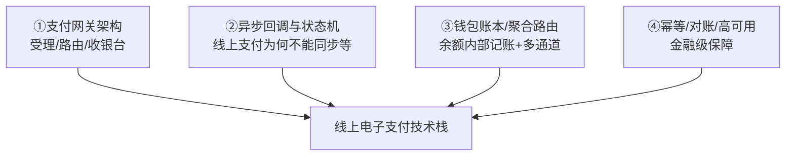
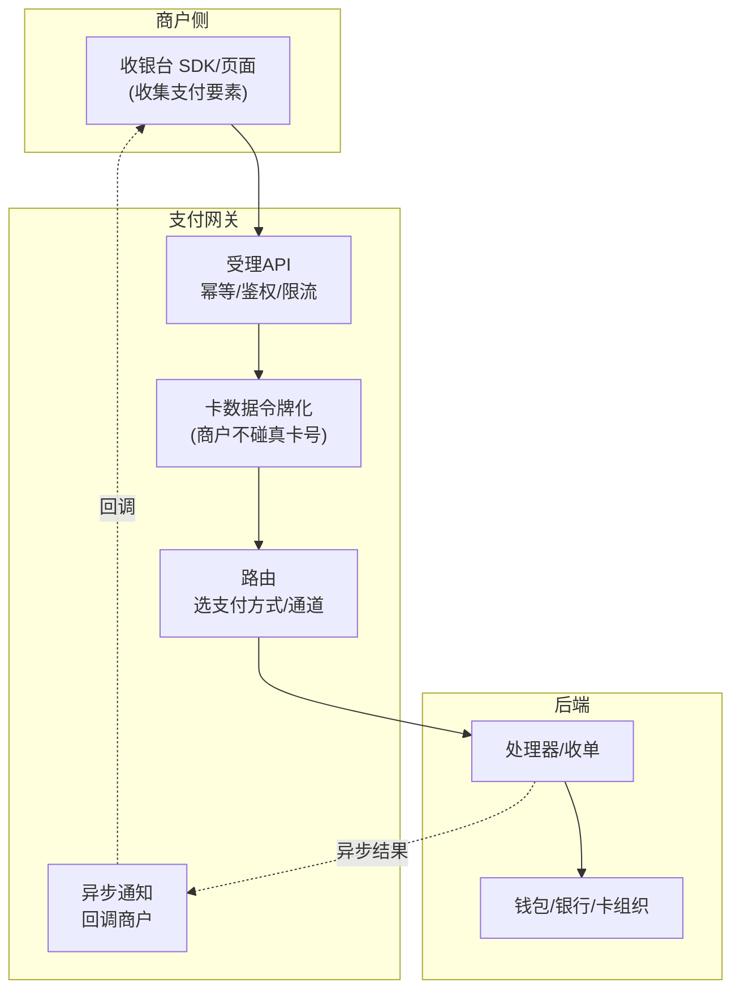
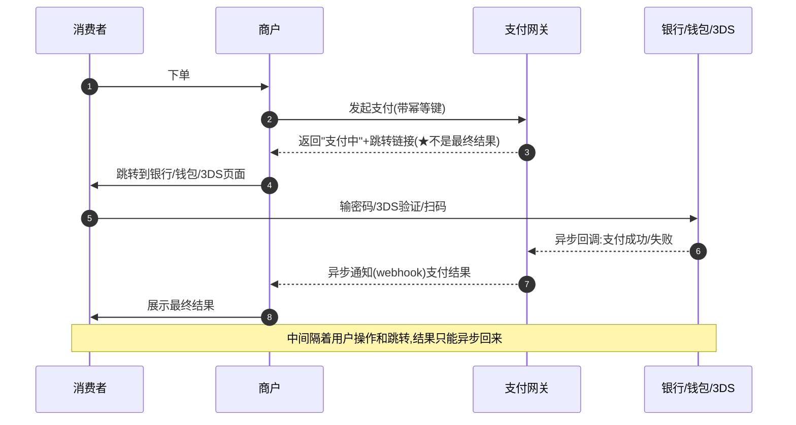
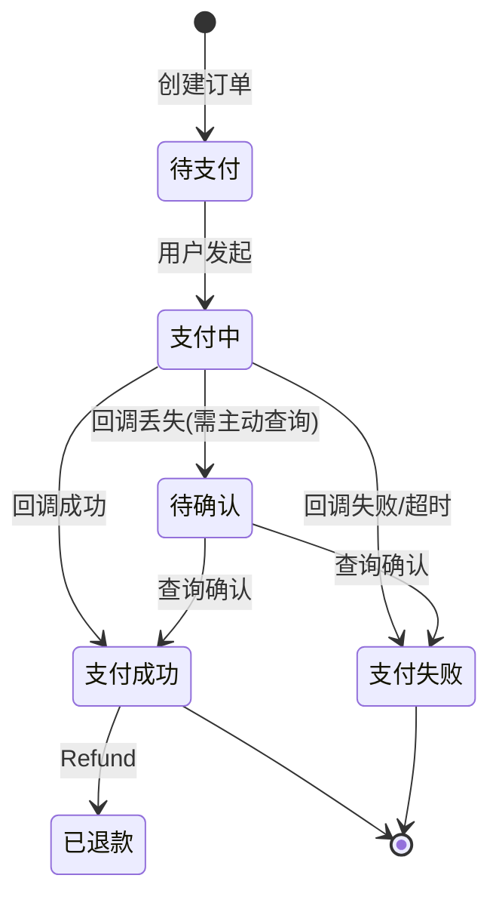
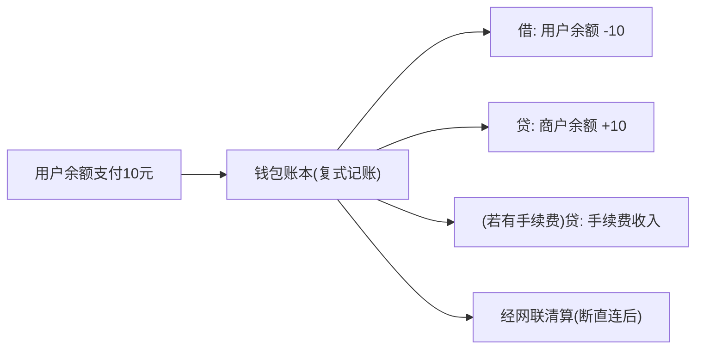
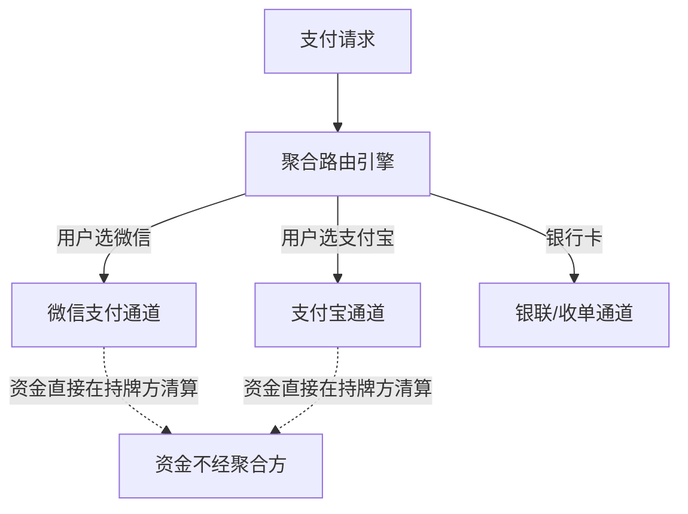
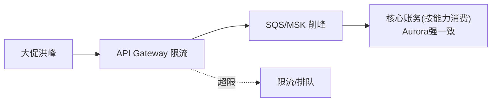
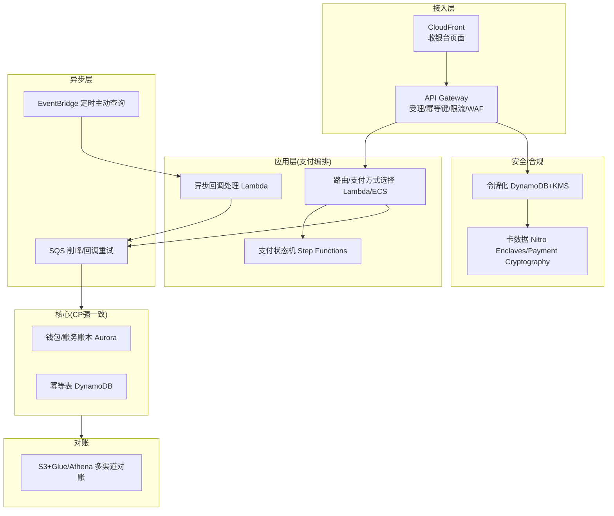

# 模块 2 · 互联网电子支付（技术篇）：网关架构与 AWS 方案

> **学习者**：AWS 技术架构师 · 支付小白
> **本篇目标**：把业务篇的网关、第三方支付、钱包翻译成工程。回答：支付网关的系统架构长什么样？线上支付为什么必须用异步回调（不能同步等结果）？钱包内部账本怎么实现？聚合支付如何路由？这套系统的幂等、对账、高可用怎么做？——每项映射到 AWS。
> **前置**：业务篇 `02-epayment-business.md`、地基技术篇 `00-foundation-tech.md`、模块1技术篇（收单系统）
> **组织方式**：top-down 主线叙述。零散追问见文末「附：常见追问」。
> 标注：🔧 通用技术 · ☁️ AWS · ⚠️ 坑点 · 🎯 与支付公司技术交流要点

---

## 1. 全景：线上支付的技术栈

线上支付相比线下刷卡（模块1），技术上多了三个挑战：**网络不可靠**（要异步）、**卡数据安全**（商户不能碰卡号）、**高并发**（大促峰值）。本篇主线：

> 🎯 **交流要点**：线下授权是"同步秒回"（模块1），线上支付的核心技术差异是**大量依赖异步**——因为支付涉及跳转银行/钱包 App、3DS 验证、用户操作，结果不可能在一个 HTTP 请求里同步返回。理解"线上支付是异步的"，是模块2技术的核心。

---

## 2. 支付网关的系统架构

### 2.1 网关在做什么（技术视角）

📌 业务篇说网关是"线上 POS"。技术上它是一个**受理 + 路由 + 安全 + 异步通知**的系统：

🔧 关键技术点：
- **卡数据令牌化（模块1技术篇）**：消费者卡号通过网关 SDK 直接加密上送，**绝不经过商户服务器**——大幅缩小商户 PCI 范围。
- **收银台托管**：网关提供托管收银台页面（hosted checkout），商户重定向过去，卡数据在网关侧处理。

### 2.2 同步授权 vs 异步通知（为什么线上必须异步）

⚠️ 这是模块2技术的核心，也是最容易被低估的坑：

🔧 **为什么不能同步等结果**：支付中间隔着"用户跳转到银行 App、输密码、3DS 验证、扫码确认"，这些可能几秒到几分钟，HTTP 同步请求等不了。所以：
- 网关先返回"支付中 + 跳转链接"
- 真正结果通过**异步回调（webhook/notify）**通知商户
- ⚠️ **回调不可靠**：网络可能丢、商户服务器可能宕——所以要有**重试机制 + 主动查询接口**（商户主动查支付状态作兜底）。

> 🎯 **交流要点**：能讲"线上支付=先返回支付中、结果异步回调、回调要重试、再加主动查询兜底"——这是支付网关工程的核心。很多支付 bug（重复发货、漏单）都源于异步回调处理不当。

### 2.3 支付状态机

🔧 一笔线上支付的状态流转（异步的必然产物）：

⚠️ "支付中→待确认"这条线最关键：**回调可能丢失，绝不能默认失败**，必须主动查询银行/钱包的真实状态——否则会出现"用户扣了钱但订单显示失败"的资损/投诉。

☁️ **AWS**：状态机用 **Step Functions** 或 **DynamoDB + 状态字段**；异步回调用 **API Gateway + Lambda** 接收，**SQS** 削峰+重试，**EventBridge** 调度定时主动查询任务。

---

## 3. 钱包内部账本与聚合路由

### 3.1 钱包余额支付的账本实现

📌 业务篇说余额支付是"内部账本调整"。技术上就是模块0 的**复式记账**在钱包内执行：

🔧 关键：余额支付在钱包内部就是**强一致的复式记账**（借用户、贷商户，借贷相等），即时完成。但⚠️ 中国"断直连"后，涉及银行账户的资金变动仍需经**网联清算**——内部记账≠最终清算。

☁️ **AWS**：钱包账本用 **Aurora**（强一致 ACID，复式记账核心），**DynamoDB** 做幂等和高频读，账本是 CP 系统（见地基技术篇）。

### 3.2 聚合支付的路由

📌 聚合支付要把交易路由到正确的通道（支付宝/微信/银联），且**不碰资金**（二清红线）：

🔧 聚合方只做"路由+引流+对账数据归集"，资金清算由持牌方完成——这在技术上意味着聚合方**不持有资金账户**，只持有交易记录和回调中转。
☁️ **AWS**：路由引擎用 Lambda/ECS + DynamoDB（通道配置），回调中转用 API Gateway+SQS。

---

## 4. 幂等、对账、高可用（金融级保障）

### 4.1 幂等（线上支付的重灾区）

⚠️ 线上支付的幂等问题比线下更严重——用户重复点击、网络重试、回调重投都可能导致重复扣款/重复发货。

🔧 复用地基技术篇的幂等机制，线上场景的要点：
- **支付幂等键**：商户订单号（或订单号+金额）作为幂等键，同一订单多次发起只扣一次。
- **回调幂等**：同一笔支付的回调可能被银行/钱包**重复发送**，商户处理回调必须幂等（用支付流水号去重）。
- ☁️ **AWS**：DynamoDB 条件写入（`attribute_not_exists`）做幂等去重表，SQS FIFO 队列做回调精确一次处理。

### 4.2 对账（线上多方对账）

🔧 线上支付涉及多方（网关/处理器/各支付渠道/钱包），对账更复杂：
- 商户账本 vs 网关账单 vs 各渠道（支付宝/微信/银联）账单逐笔核对
- 找出"单边账"（一方记了一方没记，常因回调丢失）、金额不符
- ☁️ **AWS**：S3 存各渠道对账文件 + Glue/Athena 大规模比对（复用地基技术篇对账架构）+ Step Functions 编排 + SNS 告警差异。

### 4.3 高并发与高可用

🔧 大促（双11/黑五）峰值是线上支付的极限考验：
- **削峰**：用 SQS/Kafka 把瞬时洪峰异步化，后端按能力消费
- **限流熔断**：保护核心账务系统不被打垮
- **多活**：核心支付链路多 AZ/多 Region，无单点
- ☁️ **AWS**：API Gateway（限流）+ SQS/MSK（削峰）+ Aurora（读副本扩展）+ DynamoDB（自动扩展）+ 多 AZ 部署 + Route 53 故障转移。

---

## 5. 完整技术架构图

| 能力 | ☁️ AWS |
|---|---|
| 受理入口/限流 | API Gateway + WAF |
| 收银台页面托管 | CloudFront + S3 |
| 支付编排/状态机 | Step Functions / Lambda / ECS |
| 异步回调削峰重试 | SQS（FIFO 精确一次）+ EventBridge |
| 钱包/账务账本(强一致) | Aurora + DynamoDB（幂等） |
| 卡数据/令牌 | DynamoDB+KMS / Nitro Enclaves / Payment Cryptography |
| 对账 | S3 + Glue/Athena |
| 高可用 | 多 AZ/Region + Route 53 |

> 🎯 **交流杀手锏**：能给出"受理（API Gateway）+ 编排（Step Functions）+ 异步（SQS 削峰重试）+ 强一致账本（Aurora）+ 卡数据合规（Payment Cryptography/Nitro）+ 对账（Glue）"这套完整 AWS 电子支付架构，并能解释每个组件解决的具体问题（异步/幂等/削峰/合规），是 AWS SA 切入支付平台客户的核心能力。

---

## 6. 本篇小结（背下来）

1. **线上支付的核心技术差异 = 异步**：先返回"支付中"，结果异步回调，回调要重试 + 主动查询兜底。
2. **支付网关 = 受理+令牌化+路由+异步通知**，托管收银台让商户不碰卡号（缩 PCI 范围）。
3. **支付状态机**的"支付中→待确认"是关键：回调可能丢，绝不默认失败，必须主动查询。
4. **钱包余额支付 = 钱包内复式记账**（强一致），但涉及银行账户仍经网联清算。
5. **聚合支付不持有资金账户**，只做路由+引流+对账归集（二清红线）。
6. **幂等是线上重灾区**：支付幂等键（订单号）+ 回调幂等（流水号去重）。
7. **高并发靠削峰**：SQS/Kafka 异步化洪峰，限流熔断保护核心账务。
8. **AWS 电子支付栈**：API Gateway + Step Functions + SQS + Aurora + Payment Cryptography + Glue。

---

## 7. 通向下一层

- **业务全景回顾** → `02-epayment-business.md`
- **跨境电子支付：多币种/换汇/SWIFT** → 模块3 与 `跨境支付深度研究报告.md`
- **链上账本（绕开所有中介的极致）** → 模块4（稳定币）
- **账务/对账/非功能性深入** → 模块6 横向专题

---

## 附：常见追问（FAQ）

**Q：为什么线上支付不能像线下刷卡那样同步返回结果？**
A：线下刷卡，卡和 POS 在现场，授权链路是机器到机器的同步请求（秒级）。线上支付中间隔着"用户跳转银行/钱包 App、输密码、3DS 验证、扫码"，这些是人的操作、不确定耗时，HTTP 同步请求等不了。所以线上必须异步：先返回支付中，结果通过回调异步通知。

**Q：回调（webhook）丢了怎么办？会不会漏单或重复？**
A：双保险。①**重试**：支付方会多次重发回调（所以商户处理回调必须幂等，用流水号去重，防重复发货）。②**主动查询**：商户定时主动查询支付方的真实状态作兜底（防回调彻底丢失导致漏单）。"支付中"状态超时未收到回调，就触发主动查询，绝不默认成功或失败。

**Q：余额支付走网联吗？它不是钱包内部记账吗？**
A：分两步看。钱包内部"借用户余额、贷商户余额"是钱包自己的账本调整（即时）。但只要涉及**银行账户**的资金实际变动（如用户充值、商户提现、或余额不足时从绑定银行卡扣款），就要经**网联**清算（断直连后的合规要求）。纯余额对余额的内部划转是钱包内部记账，但最终的资金沉淀和银行侧清算仍受网联监管。

**Q：支付网关和模块1的收单系统是什么关系？**
A：网关是收单系统的**前端受理组件**（模块1技术篇 §4 讲过收单系统逻辑分层）。线上场景，网关是"互联网时代的 POS"——它在收单链路的最前端，负责受理和令牌化，后面接处理器/收单/清算。所以模块2的网关和模块1的收单不是两套东西，而是收单系统在"线上受理"这一环的具体形态。
