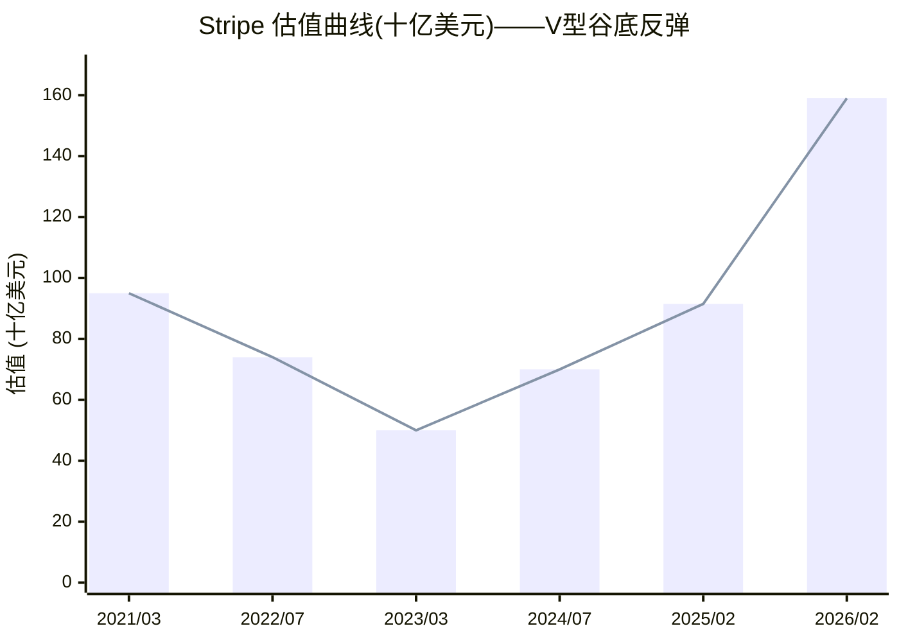
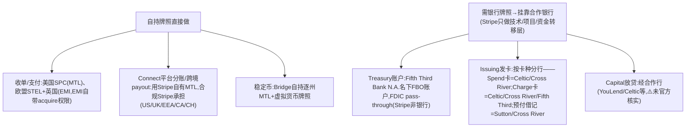
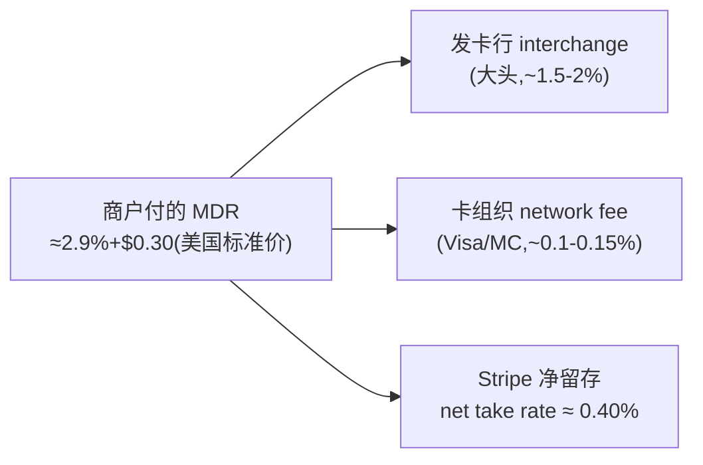
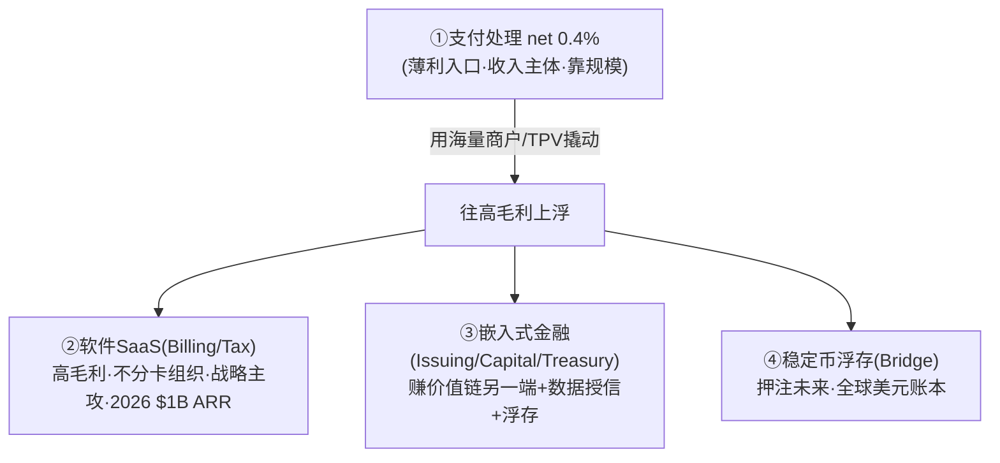

# Stripe, Inc.

> 📌 **一句话定位**：面向开发者的支付基础设施公司("互联网的经济基础设施")，以 API 为企业提供线上线下收款、订阅计费、平台分账、发卡、资金账户、税务等全栈金融服务，骑在 Visa/MC 等卡网络之上。
> 🏷️ **角色归类**：**全栈型(收单 PayFac + 网关 + 聚合 + 增值金融)**（呼应 `02-epayment-business §3.2` 开放路线、`§3.2 延伸` 为何不做钱包）。
> ⚠️ **数据时效**：截至 2026-06。📌 财务/估值/产品经 Sacra + Wikipedia + stripe.com 官方页深度核对；私有公司不披露细分财报，收入按产品线占比无官方拆分。

---

## 1. 基本信息
- **成立**：2010 年(Palo Alto)，**Patrick Collison(CEO)+ John Collison(President)** 兄弟创立(此前已把 Auctomatic 卖给 Live Current Media)
- **总部**：**双总部**——美国 South San Francisco + 爱尔兰都柏林(2025-10 开第二个都柏林 HQ)
- **当前状态**：⚠️**未上市**(私有)，无股票代码；靠 tender offer(要约收购)给员工/股东流动性，不急于 IPO；Collison 兄弟持控制权

## 2. 背景与沿革（里程碑时间线）📌
| 时间 | 里程碑 |
|---|---|
| 2010 | Collison 兄弟创立 |
| 2011-09 | 公开上线，获 Thiel/Musk/Sequoia/a16z 等 $2M |
| 2012 | 推 **Connect**(平台分账) |
| 2016/18 | Atlas(公司注册)/Stripe Press；推 **Issuing 发卡、Radar 风控** |
| 2019 | 推 Terminal(线下)、Capital(融资) |
| 2020 | 收购 **Paystack**(~$200M，进入非洲) |
| 2021 | 收购 TaxJar/Recko；推 **Link、Tax、Treasury**；估值高点 **$95B**(3月) |
| 2024-04 | 重启加密 pay-in(USDC) |
| 2025-02 | **完成收购 Bridge($1.1B，迄今最大收购)**——稳定币战略核心 |
| 2025-05 | 发布**支付 AI 基础模型** + **稳定币金融账户(101 国)** |
| 2025-06 | 收购 **Privy**(嵌入式加密钱包)；与 Shopify 推全商户稳定币支付 |
| 2025-09 | Link 破 2亿用户；与 **OpenAI 共建 Agentic Commerce Protocol(ACP)** 驱动 ChatGPT Instant Checkout |
| 2025-12 | 发布 Agentic Commerce Suite；宣布收购 Metronome；BFCM 四天处理超 $40B |
| 2026-02 | tender offer 估值 **$159B**(较 2025-02 的 $91.5B 增约 70%) |
| 2026-04 | Sessions 2026 发布 **288 项**新产品/功能 |

> 战略主线：单点"开发者友好收单 API" → 平台化"全栈金融基础设施"(收单+计费+发卡+银行+税务+注册) → 当前向"**AI 时代经济基础设施 + 稳定币 + Agentic Commerce**"延伸。

## 3. 股东与资本 📌
- **早期投资人**：Peter Thiel、Elon Musk、Sequoia、a16z、SV Angel(2011 种子 $2M)
- **估值曲线(剧烈波动)**：2021-03 **$95B** → 2022-07 内部降 **$74B** → 2023-03 Series I($6.5B+)按 **$50B**(谷底) → 2024-07 409A **$70B** → 2025-02 约 **$91.5B** → **2026-02 tender offer $159B**

| 时点 | 2021/03 | 2022/07 | 2023/03 | 2024/07 | 2025/02 | 2026/02 |
|---|---|---|---|---|---|---|
| **估值($B)** | **95**(高点) | 74 | **50**(谷底) | 70 | 91.5 | **159**(新高) |
| 事件 | 互联网泡沫顶 | 内部下调 | Series I | 409A | tender | tender |

> 📌 **看曲线**(⚠️ xychart 不显示点上数字，精确值见上表)：2021 高点 $95B → 2022-2023 互联网估值寒冬腰斩至 **$50B 谷底**(几乎砍半) → 2024-2026 随盈利兑现+稳定币/AI 叙事反弹至 **$159B**(为谷底的 **3.2 倍**、超 2021 高点 **67%**)。典型"高点→腰斩→新高"的 V 型，反映私募估值对宏观利率与赛道叙事的高度敏感。
- 累计融资约数十亿美元；Collison 兄弟持控制权

## 4. 牌照与资质（逐法域：牌照类型+业务范围+怎么开展+合规）📌

> 💡 **找牌照的替代办法**(主页 stripe.com/legal/licenses 常 404，但这些可达/可查)：① **SPC 子页 stripe.com/legal/spc/licenses**(列约 50 法域监管机关+NMLS#) ② **Bridge bridge.xyz/legal**(稳定币逐州证号最全) ③ **NMLS Consumer Access**(查各州证号) ④ **FCA Register / 爱尔兰央行 registers.centralbank.ie**(查 EMI 号) ⑤ **docs.stripe.com**(各产品合规/银行合作页)。**牌照是公开监管事实，不靠官网披露**。

📌 **总体结构**：Stripe 把"持牌"分散在不同法人实体，**自持支付类牌照(MTL/EMI)打底 + 需银行牌照的功能(存款/发卡/放贷)统统挂靠合作银行**。

### 4.1 逐法域牌照与业务范围

| 法域 | 持牌实体 | 牌照类型/证号 | **法律允许做什么** |
|---|---|---|---|
| **美国** | **Stripe Payments Company(SPC)** | 各州 **MTL** + FinCEN **MSB**(NMLS **#1280479**，官方页口径；⚠️坊间 913460 未在 NMLS 复核) | 接收并按指令转移/汇出资金、为平台代收代付、持有客户资金(stored value)——这是 Connect payout、Treasury 资金账户的法律基础。NY 等少数州虚拟货币另需 BitLicense |
| **欧盟/EEA** | **Stripe Technology Europe Ltd(STEL)**，爱尔兰 | 爱尔兰央行 **EMI**，参考号 **C187865**，授权 2019-03-22(LEI 549300T7WU87LQYO0K16) | 发行电子货币+执行支付+汇款+**发行并受理(acquire)支付工具**+支付发起(PIS)+账户信息(AIS)，经 **EU passporting** 覆盖整个 EEA。⚠️ 签约主体是 SPEL，但**牌照挂在 STEL**(区分) |
| **英国** | **Stripe Payments UK Ltd** | FCA **授权电子货币机构(EMI)**，FRN **900461**，授权 2018-05-02 | 发行电子货币+相关支付服务，脱欧后独立持牌覆盖英国 |
| **美国稳定币** | **Bridge Building Inc**(2024 收购) | 逐州 **MTL+虚拟货币牌照**，NMLS **#2450917**(已抓到逐州证号：AK AKMT-018580、AZ MT-1047501、FL FT230000461、OH OHMT 275、VA MO-484、PA 116659…) | 货币转移+**稳定币(虚拟货币)发行/兑付/转移**——USDB、Issuing 稳定币担保卡的持牌基础 |
| **欧盟稳定币** | **Bridge Building Sp. z o.o.**(波兰) | 波兰金融监管局 **KNF 虚拟货币活动登记 RDWW-794**(2025-04-18) | 非美稳定币业务承接 |
| **新加坡** | Stripe SG | ⚠️ PSA 下**临时豁免运营**，MPI 牌照**申请中未获批** | (豁免期可运营) |
| 非洲 | Paystack(2020 收购) | 当地持牌(独立品牌) | 尼日利亚/加纳/南非收单 |
- ⚠️ 澳/加/日/印等法域持牌实体与证号、SPC 逐州证号(NMLS 直链 403)未独立核实

### 4.2 Stripe 怎么开展业务：自持牌照 vs 合作银行 📌docs

> 📌 **一句话**：**收单+平台分账=自持牌照直接做(欧盟/英国 EMI 自带 acquire 权限)；存款(Treasury)/发卡(Issuing)/放贷(Capital)等需要银行牌照的功能=挂靠持牌合作银行，Stripe 只做技术+项目管理+资金转移层**。Global Payouts(直付第三方)则把合规推给平台方、平台可能需自持 MTL。

### 4.3 合规要求 📌
- **AML/KYC/制裁**：美国 MSB 受 BSA 约束(KYC/KYB+UBO≥25%识别、交易监测、SAR/CTR、OFAC 筛查、记录留存≥5年)；Connect 按国别核验(新加坡 PSA Singpass+未核验 120 天关户、巴西 BCB 3978/20、美国 payout 阈值 $600/$3k/$10k/$500k SSN)
- **PCI-DSS Level 1**(最高等级，处理卡数据；商户接 Stripe 可降自身 PCI 负担)
- **资金隔离/safeguarding**：欧盟/英国 EMI 按 EMD2/PSD2 隔离客户资金；美国按各州 MTL 备付金/许可投资；Treasury 资金存 Fifth Third FBO(⚠️"FDIC pass-through"非"FDIC insured"，营销措辞受限)
- **PSD2/SCA**：欧盟/英国收单受强客户认证(3DS)+资本金(EMI 初始 €350k 起)
- **卡组织成员合规**：遵守 Visa/MC 运营规则、BIN 赞助、拒付流程；发卡须附法定发卡行声明(Celtic/Cross River/Fifth Third/Sutton 逐字模板)
- **稳定币新规**：美国 **GENIUS Act(2025)**+各州虚拟货币牌照(储备/兑付/披露)；欧盟 **MiCA**(稳定币发行须授权)

### 4.4 与卡组织(Visa/MC)的关系 📌
- **发卡侧**：Stripe 与 **Visa+Mastercard 双网络**合作，可单/双发卡，但实际经**合作发卡行的 BIN 赞助**进行(Stripe 是项目方、发卡行是网络成员)
- **收单侧**：**欧盟/英国凭 EMI 牌照具备直接受理(acquire)的法定权限**(已核查)；⚠️ 是否在每个市场都是卡组织 **principal member**、以及美国精确成员身份(历史经 Wells Fargo 系合作收单行)**未独立核实**

## 5. 定位与商业模式（收入结构）📌Sacra + 结构判断

### 5.0 先理解一个关键区分：毛费率 3% vs 净 take rate 0.4%

📌 **这是看懂 Stripe 盈利的钥匙**。商户刷卡付的"3% 手续费"**绝大部分不归 Stripe**：

> 📌 **net take rate ≈ 0.40%**(Sacra)：毛费率约 3%(美国 2.9%+$0.30、日本 3.6%)扣除付给发卡行的 interchange(大头)、卡组织 network fee、合作方后，**Stripe 实际只留约 0.4%**。所以 **Stripe 公布的"收入"指净收入(net revenue)而非毛流水(TPV)**——2025 净收入 ~$6.9B ÷ TPV $1.9T ≈ 0.36%，与 0.4% 量级吻合。
> 🎯 **这决定了 Stripe 的根本逻辑**：单笔赚得薄(0.4%)，**利润靠两条腿——① 规模(TPV $1.9T 摊薄固定成本) ② 往高毛利的软件/金融服务"上浮"**。下面拆四种赚钱模式。

### 5.1 模式一：核心支付处理（Payments/Connect 抽佣）——收入主体、薄利、靠规模

🔧 **机理**：每笔成功交易抽 net take rate ~0.4%。**Connect(平台分账)是放大器**——给 Shopify/DoorDash 这类平台做底层处理，一个平台带来成千上万子商户的交易量，**用一个集成撬动海量 TPV**。
- **为什么能赚**：开发者体验+全栈集成形成高切换成本，TPV 黏在平台上持续抽佣。
- **赚多少**：收入主体(占大头)，但**毛利薄**(0.4% 里还要扣自身成本)，是"规模生意"非"高毛利生意"。
- **天花板**：take rate 受卡组织 interchange 挤压，难提价 → 这正是 Stripe 必须往 §5.2/5.3 升级的原因。

### 5.2 模式二：软件/SaaS 增值——高毛利、战略主攻方向

📌 **"Revenue & Finance Automation"套件**(Billing 订阅计费/Tax 自动税务/Invoicing/Sigma 数据/Revenue Recognition)——**2026 年有望达 $1B 年化运行率**，较 2025-02 的 ~$500M **翻倍**。
- 🔧 **机理**：按**订阅费/按量费**收钱(如 Tax 0.5%/笔、Billing 按订阅收入比例)，**不经过卡组织分成 → 毛利远高于支付处理**。
- **为什么战略上猛推**：支付处理 0.4% 薄利封顶，**软件是改善整体 margin 的关键**——同样的商户，多卖一个 Billing/Tax 订阅，几乎纯增毛利。
- **黏性**：商户把计费/税务/对账都跑在 Stripe 上 → 切换成本极高，反过来锁死支付处理那条腿。
- 📌 这是 Stripe **从"支付公司"变"金融软件公司"**的核心叙事，也是它估值能给到 $159B(远超纯支付倍数)的逻辑支点。

### 5.3 模式三：嵌入式金融服务（Issuing/Capital/Treasury）——赚金融的钱

🔧 把支付能力延伸到发卡、放贷、银行账户，**赚金融服务的钱**(比支付处理毛利高)：
- **Issuing(发卡)**：商户用 Stripe 发企业卡，Stripe 分 **interchange**(发卡侧那块大头的分成)——从"替别人收单付 interchange"变成"自己发卡赚 interchange"，**赚价值链的另一端**。
- **Capital(商户融资)**：基于 Stripe 掌握的商户流水数据授信、放现金垫款，收**固定费**(非利息，按日销售额比例扣还)——**数据是护城河**(别人没有商户实时流水，授信风控做不准)。美国由 YouLend 用 Stripe 技术提供。
- **Treasury(BaaS 银行即服务)**：给平台的终端用户开资金账户，赚账户/资金沉淀(**浮存利息**)。⚠️ Stripe 非银行，存款靠合作行 **Fifth Third Bank**(FDIC pass-through)。
- 📌 **共同逻辑**：支付只是入口，**把商户的"钱流"变成"金融关系"**(发卡/借贷/存款)，每一层都比 0.4% 的支付抽佣更赚。

### 5.4 模式四：稳定币浮存（Bridge）——新兴、押注未来

🔧 **机理**：Bridge 的稳定币(USDB 等)储备金**投美国国债赚 3-4% 利息**(浮存)——用户持有稳定币余额，Stripe 赚储备金的利息差。
- **占比**：尚小、未披露，是**押注未来**而非当下利润。
- **战略意义**：稳定币是"**可编程的全球美元账本**"，若 Agentic Commerce/跨境支付规模化，**稳定币浮存可能成为继支付处理后的新基本盘**——这也是 Stripe 花 $1.1B(最大收购)买 Bridge 的原因。

### 5.5 四种模式的关系：薄利入口 → 高毛利上浮 → 金融变现 → 未来押注

> 📌 **一句话**：Stripe 用**薄利(0.4%)但高黏性的支付处理**当入口锁住海量商户，再把它们**往高毛利的软件、金融服务、稳定币上浮**——这是"支付不赚钱、是入口"在 B 端的精确演绎(对比 `02-epayment-business §6.1` 支付宝 C 端"支付是入口、金融增值是利润")。
> 📌 **盈利结果**：2024 税前利润 $101.9M(首次扭亏)→ 2025 **EBITDA 约 $1.2B**(Sacra)——薄 take rate 靠规模+软件化升级，终于跑出利润。⚠️ 各模式具体收入百分比 Stripe 未上市不披露，以上为 Sacra/结构判断。

## 6. 核心产品与业务范围 📌stripe.com 官方页逐个核实
- **Payments(旗舰)**：在线/移动收单核心，支持 Visa/MC/Amex/JCB/Discover + 数字钱包(Apple/Google Pay/PayPal/Alipay/微信/Cash App)+ 本地方式(Boleto/OXXO/PromptPay/PayNow)；**135+ 货币、30+ 国直接**；组件 Checkout/Elements/Payment Links/Invoicing；收入优化 Adaptive Acceptance/智能路由/自动卡更新/3DS2
- **Connect**：多方支付/平台基础设施，**16,000+ 平台、1,100万+ 注册账户**；嵌入式 KYC 入驻(46+国/14语言，含 AML/MATCH list)；用户 Shopify/DoorDash/Instacart/Lyft/GitHub/Salesforce
- **Billing**：订阅与计费全生命周期，**35万企业、~2亿活跃订阅**；Smart Retries 平均挽回 55% 失败支付；收入确认(ASC606/IFRS15)；企业级用量计费经 **Metronome**(2026-01 收购)
- **Radar**：ML 反欺诈，基于全网 **$1.9T/年、197 国**数据训练(92% 卡此前见过)，平均降欺诈 32%；含 Verifi/Ethoca 争议预防
- **Issuing**：发卡平台(虚拟+实体)，可由信用/已赚收入/**稳定币余额**支撑，赚 interchange 分成，已与 Bridge 集成发"稳定币支撑卡"
- **Terminal**：线下收单(Reader S700/Tap to Pay)；**Capital**：商户现金垫款(基于流水授信，美国由 YouLend 提供)
- **Treasury**：BaaS 银行即服务，美国资金存合作行 **Fifth Third Bank**(FDIC pass-through)，⚠️ Stripe 本身非 FDIC 机构
- **Tax**：自动税务(100+ 国+全美各州，600+ 类目，0.5%/笔)；**Atlas**：创业公司注册(Delaware+EIN+83(b)，与 Cooley 合作)
- **Link**：加速结账网络，**2亿+ 用户**(2025-09 破)，回头客完成率 +14%，OpenAI 案例结账 +40%

## 7. 业务区域 📌
- **北美(核心基本盘)**：美国(最大市场，Stripe Payments Company 持各州 MTL，Treasury 由 Fifth Third 托管)；加拿大直接运营
- **欧洲(第二据点)**：爱尔兰都柏林(双总部之一，SPEL 持 CBI EMI passport EEA)；英国(FCA)；2026-06 与 Lloyds 合作服务英国小微；"在法国十年"(2026-05)
- **亚太(扩张中)**：日本(2025-09 推 Terminal Japan 支持 PayPay)、新加坡、澳大利亚、印度直接运营，支持 PayNow/PromptPay/GrabPay/KakaoPay
- **拉美**：墨西哥(OXXO)、巴西(Boleto)｜**非洲**：经 Paystack(尼日利亚/加纳/南非，独立品牌)
- 跨境 payout 自助限 US/UK/EEA/CA/CH 五区互转(0.25%/笔)，其余需联系销售；整体支持 135+ 货币

## 8. 规模与数据 📌Sacra+Wikipedia+年报（多年趋势）
- **净收入**：2023 **$3.82B** → 2024 **$5.1B(+34%)** → 2025 **~$6.9B**(口径 28%~36% 有差异)
- **TPV**：2024 **$1.4T** → 2025 **超 $1.9T(+34%)**，为 500 万家企业处理
- **盈利曲线(显著改善)**：2023 税前亏 $1.2B → 2024 税前利润 $101.9M(**扭亏**) → 2025 EBITDA 约 $1.2B
- 员工 ~8,500(2025)；BFCM 2025 四天处理超 $40B

## 9. 组织架构 + 管理层 📌Stripe leadership 页
- **Patrick Collison**(CEO/董事，1988 生于爱尔兰 Limerick，MIT 辍学)、**John Collison**(President/董事，弟)
- **CFO Steffan Tomlinson**(前 Google Cloud CFO)；**CTO Rahul Patil**(新晋，接替 David Singleton，负责 ledger/billing/监管税务平台)；**CBO William Alvarado**
- 董事会：Mark Carney 2021 入、2025 离任(竞选加拿大自由党领袖)
- **法律实体**：Stripe, Inc.(美母公司)→ Stripe Payments Company(美持牌)/SPEL(爱尔兰 EMI)/Stripe Payments UK(FCA)/Bridge Building Inc(美)·Sp. z o.o.(波兰)·Bridge Ventures LLC(稳定币)。⚠️ 内部事业群按产品线(Payments/Revenue&Finance Automation/BaaS/Stablecoin-Bridge/Atlas)

## 10. 技术架构特点 📌
- **API-first**：开发者友好 REST API+幂等键+完善文档+多语言 SDK，是"开发者最爱"定位的技术根基；Billing 报 99.999% 可用性(自述)
- **AI 布局**：2025-05 发布**支付基础模型**(用全网 $1.9T/197国交易数据训练，用于欺诈识别/授权优化)；2026-04 Sessions 发 288 项 AI 功能
- **Agentic**：与 OpenAI 共建 **ACP 协议**(AI agent 对话内下单结算)；2026-05 接入 **AWS AgentCore + Privy** 做 agent 支付
- **稳定币栈**：Bridge(Orchestration/Issuance API+自有稳定币 **USDB** 1:1 USD+BlackRock 基金支撑)；Privy(TEE 硬件隔离+分布式密钥分片嵌入式钱包，支持 EVM/Solana/Bitcoin)
- ⚠️ 是否自建/用某公有云无权威一手披露(历史有用 AWS 报道，未核)

## 11. 护城河与差异化
① **开发者体验/API 标准**(开发者心智+高切换成本) ② **全栈产品锁定**(收单→发卡/银行/税务/注册，交叉销售) ③ **Radar 全网数据网络效应**(92% 卡见过) ④ 多区域牌照(爱尔兰 EMI+美国 MTL) ⑤ **Link 一键结账网络效应**(2亿用户) ⑥ **稳定币卡位最激进**(Bridge $1.1B+Privy 双收购+自有 USDB，把"全球美元账本"卡进自家栈)

## 12. 主要竞争对手 📌+🔧具体对比
- **vs Adyen(最直接企业级对手)**：2024 TPV Stripe $1.4T vs Adyen €1.29T，量级相当。Stripe="开发者最爱"API/可定制强、中小+数字原生+长尾平台广；Adyen=单一平台 unified commerce、线上线下一体、**大企业/全渠道零售更强**且长期盈利(Stripe 2024 才扭亏)。牌照：Adyen 自持银行牌照度高，Stripe 美国靠 MTL/欧洲靠 EMI、银行能力靠合作行
- **vs PayPal/Braintree**：Stripe 在开发者/企业集成胜，PayPal 强 C 端钱包网络
- **vs Block(Square)**：Square 强线下中小商户/POS，Stripe 主战线上+平台
- **差异化护城河**：产品广度 + Radar 全网数据 + 开发者生态 + 稳定币卡位(竞品中最激进)

## 13. 监管与最新动态 ⚠️时效 2025-2026
- 📌 **2026-03-26 FTC 警告信**：FTC 主席致信 Stripe/PayPal/Visa/MC，警告"**debanking**"(因政治/宗教观点拒服务)可能违反 FTC Act 第5条——属警告非处罚
- 📌 裁员：2022-11 约 14%；2025-01 约 300 人(因"卡通鸭子"通知图争议道歉)
- ⚠️ 未查到 Stripe 受重大监管罚款/牌照吊销公开记录(未上市无 10-K，非穷举)
- **最新动态**(详见 §2 时间线)：2025-05 稳定币账户/支付AI模型、2025-06 Privy、2025-09 ACP/Link 2亿、2025-12 Agentic Commerce Suite/Metronome、2026-02 估值 $159B、2026-04 Sessions 288 项、2026-05 AWS AgentCore 合作

## 14. 标杆客户 📌
- **数字原生巨头**：Amazon、Airbnb、Uber、**OpenAI**、Atlassian、**Shopify**、DoorDash、Instacart、Lyft、GitHub、Salesforce、Substack
- **传统大企业**：BMW、Ford、Maersk、Le Monde
- **代表案例**：Shopify(Stripe 是 Shopify Payments 底层处理方，2025-06 推全商户稳定币)；OpenAI(Link 提速 40%+ACP 驱动 ChatGPT Instant Checkout)；Deel(2026-06 承包商稳定币钱包)；Bridge 稳定币 API 客户含 Klarna/MetaMask/Bitso 等
- ⚠️ Amazon 在名单确认，但具体使用范围(全量 vs 特定业务线)未独立核实

## 15. 与本研究 / AWS 对话的衔接
- **可聊**：**开放路线全栈收单的极致**(§3.2)；为何刻意不做 C 端钱包(§3.2 延伸)；**净 take rate 仅 0.4%、靠规模+软件化升级利润**的盈利结构；**稳定币卡位最激进**(Bridge/USDB/Privy，与模块4/模块5 强衔接)；ACP/Agentic Commerce(模块5)
- **AWS 角度**：① **2026-05 已与 AWS AgentCore 合作做 agent 支付**——直接对话入口；② 支付基础模型/Agentic Commerce 是大规模 AI 推理+实时风控负载(Bedrock 协同)；③ 稳定币账户多法域合规+低延迟清结算(多 Region/HSM/KYT)；④ Atlas 客户群是 AWS 创业生态天然交集
- **风险信号**：估值剧烈波动(宏观敏感)、长期未上市靠 tender offer、2026-03 FTC debanking 警告(政治监管风险上升)、净 take rate 仅 0.4%

## 16. 来源清单 📌
- **牌照(一手)**：**stripe.com/legal/spc/licenses**(SPC 美国约50法域+NMLS #1280479)、**bridge.xyz/legal/licenses/us-licenses-and-registrations**(Bridge NMLS #2450917 逐州证号)、/non-us-licenses(波兰 KNF RDWW-794)、FCA Register(Stripe Payments UK EMI FRN 900461)、爱尔兰央行名录(STEL EMI C187865)
- **怎么开展/合规(一手 docs)**：docs.stripe.com/connect/cross-border-payouts(自有 MTL)、/issuing/compliance-us(发卡行 Celtic/Cross River/Fifth Third/Sutton+声明模板)、/treasury/marketing-treasury(Fifth Third FBO+FDIC pass-through)、/issuing/how-issuing-works(Visa+MC)、/connect/required-verification-information(各国 KYC/PSA/BCB)
- 产品/公司：stripe.com 各产品页+newsroom、privy.io、Stripe leadership 页
- 权威二手：en.wikipedia.org/wiki/Stripe,_Inc.、/Patrick_Collison、sacra.com/c/stripe(估值/收入/TPV/EBITDA)
- ⚠️ 仍未核：SPC 逐州证号(NMLS 直链 403)、Capital 放贷行、美国收单 principal member 状态、澳/加/日/印法域、收入按产品线百分比(不披露)；FCA/CBI 官方页因前端鉴权未直连(经搜索命中转述，FRN/参考号互相印证)
