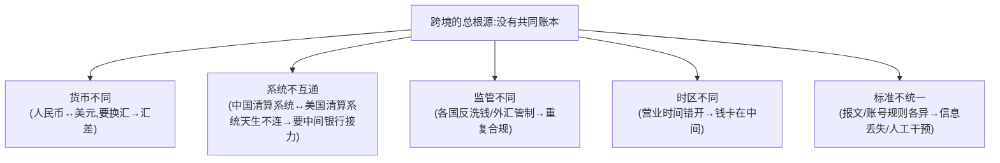
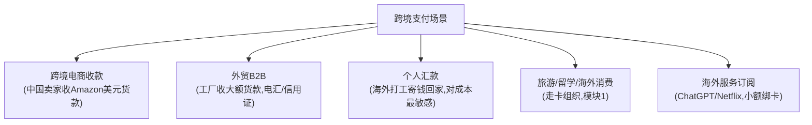
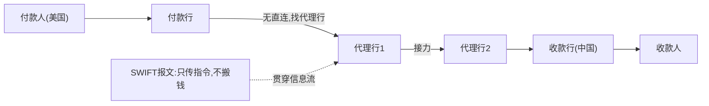
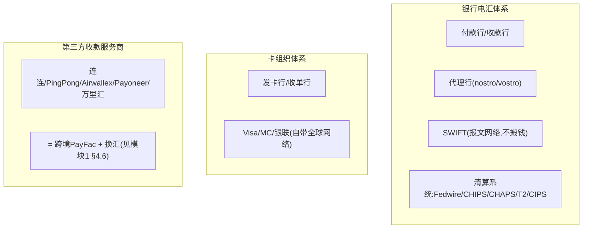
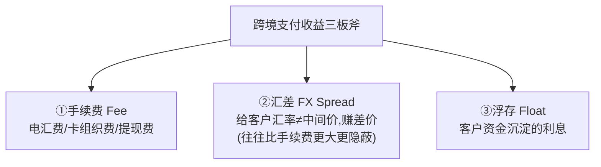
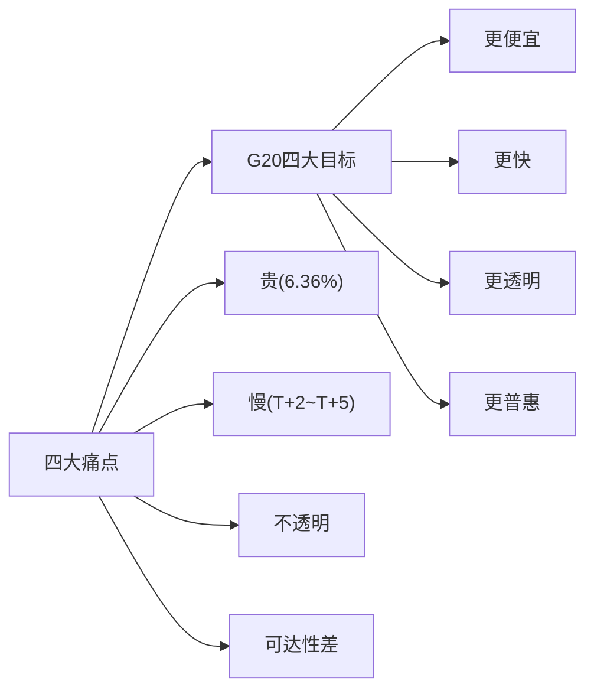

# 模块 3 · 跨境支付（业务篇）：没有共同账本的世界

> **学习者**：AWS 技术架构师 · 支付小白
> **本篇目标**：搞懂跨境支付为什么难、谁在牌桌上、钱怎么跨境流动、各方怎么赚钱。学完你能和跨境支付公司聊清楚代理行/SWIFT/清算系统/换汇/合规这套"管道"，以及中国出海收款的真实运作。
> **前置**：模块0（清算/结算/三流/货币等级）、模块1（卡四方模型/收单）、模块2（电子支付）
> **配套**：
> - 技术篇 `03-crossborder-tech-aws.md`（SWIFT报文/多币种账务/汇率引擎/制裁筛查 + AWS）
> - **带引用的一手参考**：`跨境支付深度研究报告.md`（G20路线图、各清算系统数据、新兴技术、中国出海，均带核查来源）
> - 第一性骨架：`跨境支付学习笔记.md`（四套管道对比 + 自测题）
> **组织方式**：top-down 主线。本篇是教学整合，更深的数据与引用见上述报告。
> 标注：📌 关键定义 · 💡 案例 · 🎯 交流要点 · 📖 指向深度报告

---

## 1. 全景：跨境支付的唯一总根源

模块0 的地基公理：**支付 = 在共同信任的账本上改数字**。国内支付快，因为全国银行都在同一个央行开户、共享一个最终账本。

📌 **跨境支付的唯一总根源**：**跨境，根本没有"同一个账本"**。

> 📌 **反直觉真相**：跨境支付里，**钱本身往往没真的"飞过国境"**。各国银行通过在彼此那开账户、"你记一笔我记一笔"的账本调整来等效实现跨境。SWIFT 只传报文（消息），它不搬钱。这是理解一切的关键。
>
> 🎯 **交流要点**：跨境支付的所有创新（SWIFT gpi/Nexus/稳定币/mBridge）都在回答这个总根源。能把每个技术按"它绕开了哪一步"归位，是高阶认知。详见 `跨境支付学习笔记.md` 的"四套管道"。

---

## 2. 核心业务场景：跨境支付用在哪

| 场景 | 特点 | 主要玩家 |
|---|---|---|
| **跨境电商收款** | 小额、高频、平台代收、需本地收款账户 | 连连/PingPong/Airwallex/Payoneer/万里汇 |
| **外贸 B2B** | 大额、低频、电汇(T/T)/信用证(L/C)，走 SWIFT | 银行 |
| **个人汇款** | 中小额、高频、**对成本极敏感**（6.36% 痛点在这） | Western Union/Wise/银行 |
| **旅游/留学/消费** | 走卡组织清算（模块1） | Visa/MC/银联 |
| **海外订阅** | 小额、订阅、绑卡 | 卡组织+跨境收单 |

📖 详见 `跨境支付深度研究报告.md` 第二部分。

---

## 3. 端到端流程：钱怎么跨境流动

### 3.1 核心：清算 vs 结算（模块0 概念在跨境的体现）

模块0 讲过清算（算账）≠结算（真划钱+finality）。跨境的"慢"很大程度来自：**清算结算的批量周期 + 跨时区 + 多级代理行接力**。

### 3.2 资金路径：代理行接力

📌 **代理行（Correspondent Banking）**：当付款行和收款行没有直接账户关系时，靠中间银行接力——通过 **nostro/vostro 账户**（"我存你那的钱"/"你存我这的钱"）互相记账。

> 💡 链条越长越慢、越贵（每个中间行雁过拔毛）、越不透明（看不到钱到哪一棒）。这就是跨境痛点的根源。

### 3.3 贯穿案例：一笔跨境电商美元货款怎么到中国卖家

📖 完整七步资金路径（美国买家 Amazon 下单 → 收款服务商美国本地账户 → 结汇 → 中国卖家银行卡）见 **`跨境支付深度研究报告.md` 3.3 节**——核心洞察：收款服务商把一笔跨境支付变成**"美国境内收美元 + 中国境内付人民币 + 中间自己平外汇头寸"**，即"两段境内 + 一次换汇"，避开慢而贵的 SWIFT 电汇。

---

## 4. 参与方与角色：谁在牌桌上

跨境支付有两套并行的"管道"（对应模块0笔记的四套管道）：

📌 关键玩家（详见报告第四部分）：
- **SWIFT**：全球银行间报文网络——**只传信息流，不搬钱**。
- **各币种清算系统**：Fedwire/CHIPS（美元）、CHAPS（英镑）、T2（欧元）、**CIPS（人民币跨境）**——各币种的"终极账本"。
- **第三方收款服务商**：本质是"跨境 PayFac + 换汇"（模块1 `01-cards-business.md` §4.6 已讲透）。

> 🎯 **交流要点**：能说"SWIFT 传报文、清算系统才是各币种的终极账本、CIPS 是人民币绕开美元体系的自主通道"——抓住了跨境管道的骨架。

---

## 5. 各方怎么赚钱：手续费 + 汇差 + 浮存

> 📌 **关键洞察**：**汇差往往是比手续费更大、更隐蔽的利润来源**。跨境收款服务商（连连/PingPong）的核心收益就是"提现费 + 汇差 + 浮存"。
> 📖 详见报告第五部分。

---

## 6. 行业痛点与 G20 路线图

📌 跨境支付**四大痛点**（G20/FSB/BIS 官方框架）：**贵、慢、不透明、可达性差**。
- 现实：截至 2025 Q3，全球平均汇款成本仍 **6.36%**（World Bank，已核查），远高于目标。

📌 **G20 量化目标**（2021，行业"考试大纲"）：零售成本≤1%、汇款≤3%、75% 支付 1 小时内到账，deadline 2027/2030。

📖 完整 G20 路线图、11 个量化目标、新兴技术（SWIFT gpi/Nexus/mBridge/稳定币）均带核查来源，见 **报告第六、七、八部分**。

---

## 7. 中国出海专题

📌 **国家队基础设施**：
- **CIPS**（人民币跨境支付系统）：人民币跨境清算的"终极账本"，绕开美元体系（约 194 直接/1597 间接参与者，2025 年约 180 万亿元，已核查）。
- **银联国际**：把银联卡受理网络铺向全球。
- **支付宝/微信跨境、Alipay+**：境外扫码、跨境收付。

📌 **第三方跨境收款服务商**（出海卖家核心工具）：连连/PingPong/Airwallex/Payoneer/万里汇——本质是**跨境 PayFac + 多币种账户 + 换汇 + 多国牌照**（模块1 `01-cards-business.md` §4.6 已详解）。
- 合规底座：SAFE《支付机构外汇业务管理办法》（汇发〔2019〕13号，已核查）。

📖 详见报告第九部分 + 模块1 `01-cards-business.md` §4（收单产业链：收款公司=跨境PayFac 的拆解）。

---

## 8. 本篇小结（背下来）

1. **跨境唯一总根源 = 没有共同账本**（货币/系统/监管/时区/标准 五重不同）。
2. **钱往往没真飞过国境**——靠代理行 nostro/vostro 记账 + 汇率缝合；SWIFT 只传报文不搬钱。
3. **五大场景**：跨境电商收款/外贸B2B/个人汇款/旅游消费/海外订阅。
4. **两套管道**：银行电汇（代理行+SWIFT+清算系统）+ 卡组织；第三方收款商=跨境PayFac+换汇。
5. **各币种终极账本**：Fedwire/CHIPS(美元)、CHAPS(英镑)、T2(欧元)、CIPS(人民币)。
6. **收益三板斧**：手续费+汇差(最隐蔽最大)+浮存。
7. **痛点**：贵(6.36%)/慢/不透明/可达性差；**G20 目标**：更快更便宜更透明更普惠。
8. **中国出海**：CIPS/银联国际/支付宝跨境 + 第三方收款商(跨境PayFac+换汇+多国牌照)。

---

## 9. 通向下一层

- **技术怎么实现？** → `03-crossborder-tech-aws.md`（SWIFT报文/ISO20022/多币种账务/汇率引擎/制裁筛查 + AWS）
- **带引用的深度报告** → `跨境支付深度研究报告.md`（数据/来源/新兴技术全在这）
- **第一性骨架 + 自测题** → `跨境支付学习笔记.md`
- **稳定币如何重做共同账本** → 模块4
- **跨境收款公司=跨境PayFac 的产业链拆解** → 模块1 `01-cards-business.md` §4

---

## 附：常见追问（FAQ）

**Q：跨境电商收款公司到底是不是银行？它们怎么合规收汇结汇？**
A：不是银行，是持牌支付机构（境内持 SAFE 跨境外汇业务资质，境外持各国 MSB/EMI/MSO 等牌照）。它们靠"境外本地账户收外币 + 境内结汇付人民币 + 向外管局申报"完成合规收款。详见模块1 `01-cards-business.md` §4 和报告第九部分。

**Q：SWIFT 被制裁"踢出"是什么意思？它不是不搬钱吗？**
A：SWIFT 是报文网络——被踢出意味着该国银行**无法和全球银行交换支付指令**，等于"断了通信"，跨境支付实际瘫痪（虽然 SWIFT 本身不搬钱，但没有报文，代理行不知道该怎么记账划钱）。这也是各国建自主报文/清算系统（如中国 CIPS）的动因。

**Q：为什么跨境电商收款比传统电汇快、便宜？**
A：因为收款服务商把跨境支付"拆成两段境内"——在美国境内收美元（不出境）、在中国境内付人民币（不出境），中间自己平外汇头寸。避开了"代理行接力+SWIFT电汇"这条又慢又贵的链路。本质是用规模化的"两段境内+内部换汇"替代"一笔真跨境"。
