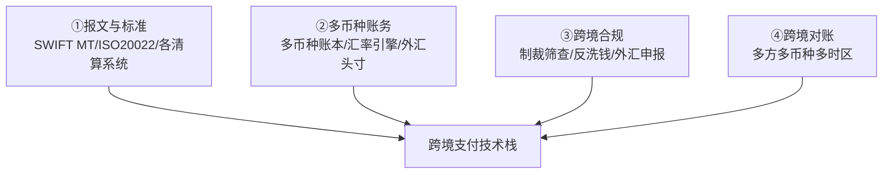
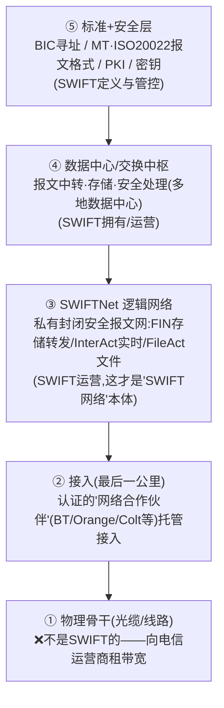
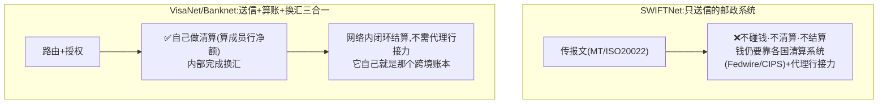
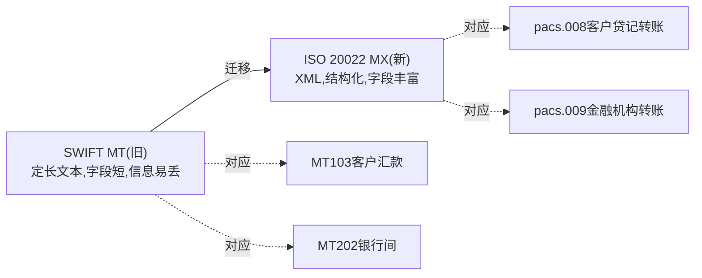
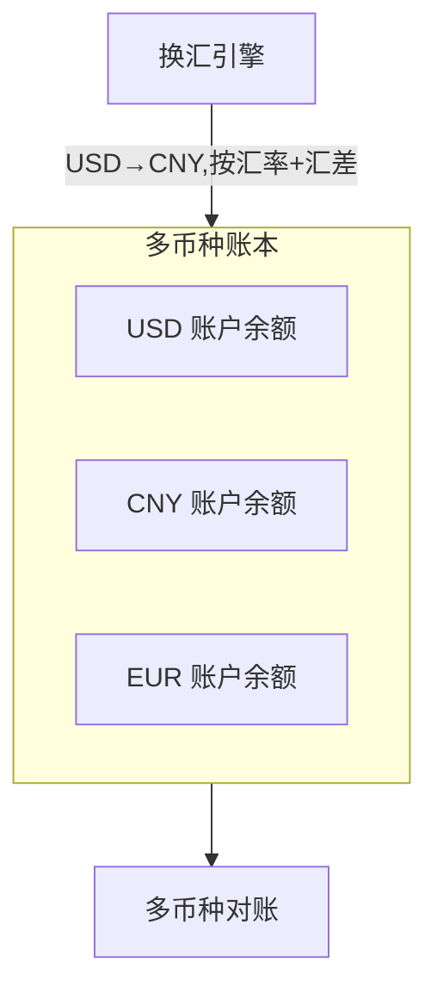
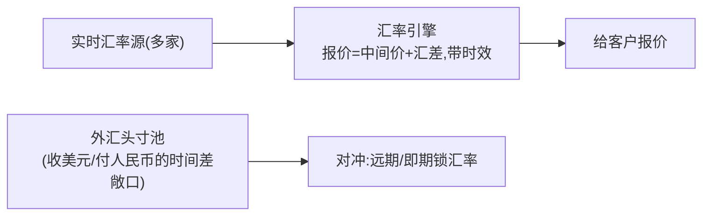
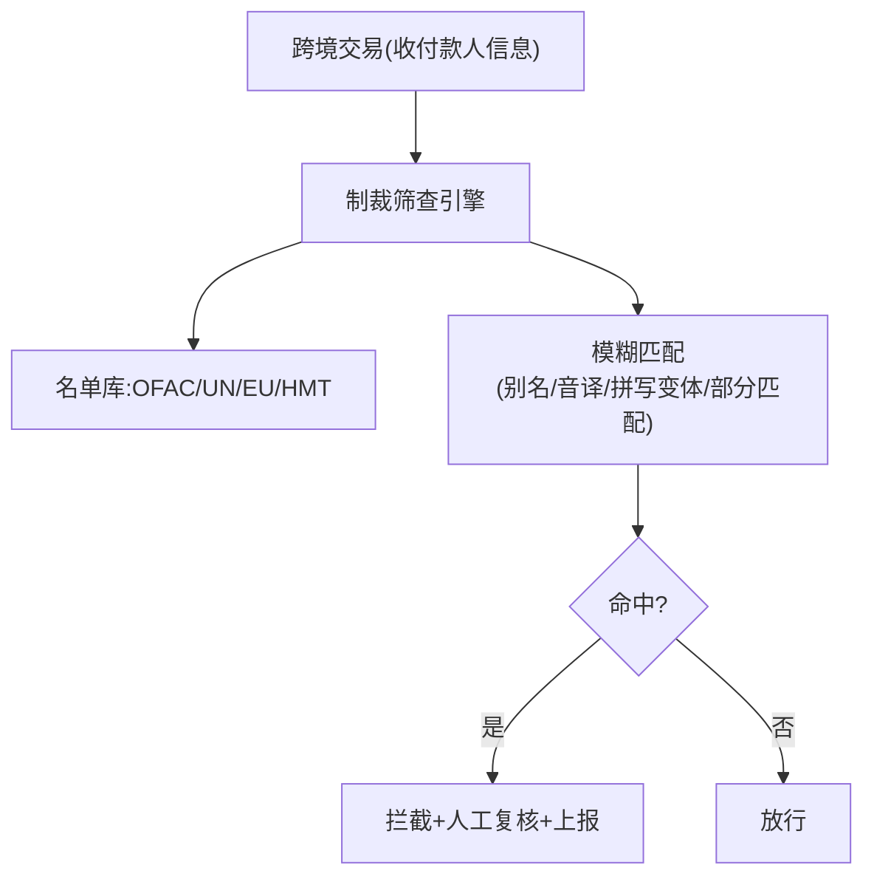
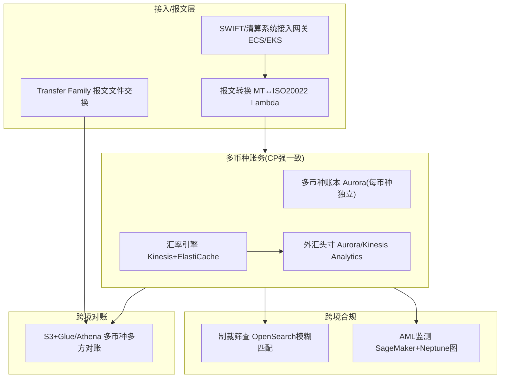

# 模块 3 · 跨境支付（技术篇）：管道、账务、合规与 AWS

> **学习者**：AWS 技术架构师 · 支付小白
> **本篇目标**：把跨境支付的"管道"翻译成工程。回答：SWIFT 报文长什么样、ISO 20022 迁移是怎么回事？多币种账务怎么设计？汇率引擎和外汇头寸怎么管？制裁名单筛查（最硬的跨境合规）怎么做？跨境对账难在哪？——每项映射 AWS。
> **前置**：业务篇 `03-crossborder-business.md`（含四套管道、G20 目标、新兴技术、引用来源）、模块0技术篇（账本/CP）、模块1技术篇（清结算/HSM）
> **组织方式**：top-down 主线。零散追问见 FAQ。
> 标注：🔧 通用技术 · ☁️ AWS · 📌 关键 · ⚠️ 坑点 · 🎯 交流要点

---

## 1. 全景：跨境支付的技术栈

跨境相比境内（模块1/2），技术上多了四个挑战：**多套报文标准、多币种账务、外汇风险、跨境合规（制裁/反洗钱）**。

> 🎯 **交流要点**：境内支付的技术核心是"账本+清结算"，跨境**额外**要解决"报文跨标准翻译、多币种账务与换汇、制裁合规、跨时区对账"。这四块是跨境支付公司的技术重头，也是 AWS 能发力的地方。

---

## 2. 报文标准：SWIFT MT 与 ISO 20022 迁移

### 2.1 SWIFT 报文（跨境的"信息流"）

🔧 模块0 讲过信息流/资金流分离——SWIFT 传的是信息流（报文）。常见报文：
- **MT103**：单笔客户跨境汇款（你给境外个人/公司汇钱）。
- **MT202 / MT202 COV**：银行间资金划拨 / 掩护支付（带原始客户信息）。
- **MT940/MT950**：账户对账单。

### 2.1.1 这些报文跑在什么网络上？——SWIFTNet 的物理/逻辑/安全分层

📌 **先破一个常见误解**：SWIFT 的"网络"**不是它自己铺的跨国光缆**，SWIFT 不是电信公司、一寸海底光缆都不拥有。它运营的是一套叫 **SWIFTNet** 的**私有、封闭、安全的报文网络（逻辑网络）**，承载网叫 **SIPN（Secure IP Network）**。把它分层拆开就清楚了：

📌 **所有权一句话**：**SWIFT 拥有"逻辑网络 + 数据中心 + 报文标准 + 安全体系"，不拥有物理光缆**——像"在租来的公路上开了一套自己的封闭专线邮政系统"。🔧 SWIFT 本身是 **1973 年由成员银行联合创立的会员制合作社**（比利时法律下 cooperative，总部布鲁塞尔附近），**由成员银行共同拥有**，不是某公司/某国政府的。

📌 **"专用、隔离、强加密"具体怎么实现**（不是一句 VPN 能概括，是多层叠加）：

| 层 | 技术 | 防什么 |
|---|---|---|
| **网络层（专用/隔离）** | **SIPN 私有 IP 专网**，与公网逻辑隔离；接入两种形态：**专线接入**（大行/高量）或**安全 VPN 隧道接入**（中小机构/备份） | 防接入公网、防外部窥探 |
| **传输层** | **TLS** 加密会话 | 防中间人、防窃听 |
| **报文/应用层（核心）** | **PKI 公钥体系**：每家机构有数字证书+私钥，报文**数字签名（防篡改+不可否认）+ 端到端加密** | 防伪造、防抵赖、防内容被改 |
| **身份/接入层** | **HSM** 保管私钥（私钥永不出硬件，呼应 `01c` HSM）；强身份认证；**RMA**（关系管理白名单，控制"谁能给谁发报文"） | 防密钥泄露、防越权通信 |

> 📌 **关键认知**：你问"VPN 还是私有专线"——**本质是私有 IP 专网（SIPN），接入既可走专线也可走 VPN**；VPN/专线只是"怎么接进去"的物理通路，真正的隔离是"整个网络与公网自成封闭域"。而**安全核心在应用层 PKI 而非网络层 VPN**——哪怕底层网络被攻破，报文本身带数字签名+加密，签名保证"确实是工行发的、内容没被改"，这是金融报文不可否认性的根。
>
> 🎯 **交流要点**：能讲"SWIFT 不铺光缆、是会员制合作社、运营的是 SWIFTNet/SIPN 逻辑专网，安全靠 SIPN 隔离 + TLS + 应用层 PKI 签名 + HSM 护私钥 + RMA 白名单"——直击"SWIFT 到底是什么"的工程实底，远超"它是个报文网络"的表层。这也解释了业务篇为什么强调 **SWIFT 只传报文不搬钱**（它本质是通信/报文层，连物理传输都是租的）、**被踢出 SWIFT 为何致命**（不是断光缆，而是从全球统一报文寻址体系里除名 = 通信断网）。
>
> ☁️ **AWS 对照视角**：SWIFTNet 是金融业自建的"封闭专网 + 端到端密码学"范式；云上对应的同类能力是 **PrivateLink/专有网络隔离 + TLS + KMS/CloudHSM 管私钥 + IAM 强身份**——理解 SWIFT 的安全分层，正好类比云上"网络隔离 + 传输加密 + 密钥硬件保护 + 身份白名单"的纵深防御。SWIFT 也提供云接入方案（如经 AWS 托管的 connectivity），是支付公司上云时的对接点。
>
> ⚠️ **可信度**：SWIFTNet/SIPN 私有专网、专线/VPN 接入、PKI 数字签名+TLS、HSM 护私钥、RMA、会员制合作社/1973 创立——均为通行公知（🔧）；各层精确协议版本、数据中心具体站点（行业记载为荷兰/美国/瑞士等，含欧洲数据驻留安排）、网络合作伙伴名单会演进，本节未做一手核查，写入正式材料请查 SWIFT 官方（swift.com，尤其 CSP 客户安全计划与 PKI 文档）。

### 2.1.2 对比：SWIFT 网络 vs 卡组织网络——同是私有专网，一个只送信、一个自带账本

📌 业务篇 §2 四管道表里，卡组织那格写的是"**私人封闭全球网络**"。它和上面的 SWIFTNet 是一回事吗？——**网络形态神似（都是租线组私有专网），但本质角色完全不同**。这正是业务篇把"电汇"和"卡组织"列为两套独立管道的技术根因。

🔧 卡组织也有自己的全球网络：Visa 的叫 **VisaNet**、Mastercard 的叫 **Banknet**，走 **ISO 8583** 报文（模块1）。

| | SWIFT（SWIFTNet） | 卡组织（VisaNet/Banknet） |
|---|---|---|
| **网络形态** | 租电信线路组私有封闭专网（SIPN） | **同样**租线组私有封闭专网（卡组也不铺光缆） |
| **报文标准** | MT / ISO 20022 | ISO 8583（模块1） |
| **干什么** | **只传报文**（邮政系统） | **报文路由 + 授权 + 清算 + 换汇** 一条龙 |
| **碰钱/算账** | ❌ 不碰钱、不清算 | ✅ **自己做清算**（算成员行净额）、内部换汇 |
| **底层账本** | 没有账本（钱在各国清算系统动） | **自己就是那个跨境账本**（四方模型在网内闭环） |
| **跨境怎么结** | 报文传完，钱还得靠代理行接力 | **网络内清算+换汇，不需代理行接力**（业务篇 §5.4） |

> 📌 **回到业务篇 §1 元洞察（账本由谁造）**：SWIFT **不造账本**（只是通信层，钱在 Fedwire/CIPS 那层动）；**卡组织造了一个账本**——它自建封闭全球网络**当账本用**，跨境刷卡的清算和换汇在网络内部就完成，绕开了代理行接力。这就是"私人封闭全球网络"作为**管道②**独立于**管道①电汇**的根本原因。
> 🎯 **交流要点**：能说"SWIFTNet 和 VisaNet 都是租线组的私有专网，但 SWIFT 只送信不碰钱、卡组织把清算换汇都包进网络自带账本"——一句话点透两套管道的本质差异。
> ⚠️ VisaNet/Banknet 名称与 ISO 8583 为通行公知（🔧）；网络物理实现细节未做一手核查。

### 2.2 ISO 20022 迁移（正在发生的全球大工程）

📌 **从 SWIFT MT 到 ISO 20022（MX）**：旧 MT 报文字段短、信息易截断；ISO 20022 用 XML、字段丰富，能装下完整收付款人/用途/合规信息。

📌 **关键映射**：MT103→**pacs.008**、MT202→**pacs.009**、pain.001（付款发起）。
📌 **迁移时间表**（已核查）：CBPR+ 迁移 2023.3 启动，跨境支付的 **MT/MX 共存期已于 2025.11 结束**——之后受监管金融机构必须用 ISO 20022 MX。

> 🔧 **第一性意义**：报文从"信息贫乏"到"信息丰富"，直接服务 G20 的"更透明、更快"——合规筛查能自动化、对账能精准匹配、人工干预减少。这是当前全球银行 IT 最大工程之一。
> 🎯 **交流要点**：能说"MT103→pacs.008、MT202→pacs.009、2025.11 共存期结束"，证明你跟得上跨境支付的报文现代化。
> 📌 ISO 20022 定义、UML 建模、XML 渲染、覆盖支付/证券/卡交易——业务篇附A [9] 有来源（Wikipedia, Secondary）。动手建议：去 iso20022.org 找一手 schema，精读 pacs.008/pacs.009/pain.001 结构。

### 2.3 各清算系统的技术差异

🔧 各币种"终极账本"的技术特性（模块0笔记已对比）：
| 系统 | 币种 | 机制 | 报文 |
|---|---|---|---|
| Fedwire | 美元 | RTGS（逐笔实时全额） | 专有/ISO20022 迁移中 |
| CHIPS | 美元 | 净额清算 | 专有 |
| T2 | 欧元 | RTGS | **原生 ISO 20022** |
| CHAPS | 英镑 | RTGS | ISO 20022 迁移中 |
| CIPS | 人民币跨境 | 实时全额+净额 | 支持中英文，可借 SWIFT |

☁️ **AWS**：对接多个清算系统/SWIFT 需要**协议适配层**——用 ECS/EKS 跑各系统的接入网关，**AWS Transfer Family**（SFTP）交换批量报文文件，报文解析/转换（MT↔MX）用 Lambda/ECS，**MQ/MSK** 做报文队列。

### 2.4 账户与机构标识：IBAN / BIC

🔧 跨境报文里要标清"钱从哪个账户来、到哪个银行去"，靠两个标识：

- **IBAN（国际银行账户号）**：欧洲等地区标准化账户号，结构 = 国家代码(2位) + 校验位(2位) + 国内账号(BBAN)。**校验机制**：把前 4 位移到末尾、字母转数字后，整串对 97 取模应 = 1（ISO 7064 Mod-97-10）——可在客户端本地拦截大量录入错误，不必等银行退票。
- **SWIFT BIC（银行识别码）**：标识一家银行的 8 或 11 位代码 = 银行代码(4) + 国家(2) + 地区(2) + 分行(3，可选)。例 `ICBKCNBJ` = 工商银行(ICBK)中国(CN)北京(BJ)。

> 🎯 **工程动手**：写一个 IBAN 校验器（Mod-97）+ BIC 格式校验，是跨境支付系统"受理层"最基础的防错。⚠️ IBAN/BIC 完整规则本轮未逐条核一手（业务篇附A 已知空白），实现时以 ISO 13616(IBAN)/ISO 9362(BIC) 原文为准。

---

## 3. 多币种账务与汇率引擎

### 3.1 多币种账本

📌 跨境的账务比境内复杂：一个客户/机构要**同时持有多个币种的余额**，每个币种独立记账（复式记账，模块0），还要处理币种间的兑换。

🔧 关键设计：
- **每币种独立账户 + 独立复式记账**（不能把不同币种混记）。
- **换汇是两笔分录**：借 USD 账户、贷 CNY 账户，中间按汇率换算 + 赚汇差（记汇差收入）。
- ⚠️ **币种精度**：日元无小数、多数币种 2 位、加密资产 8+ 位——账本要处理不同精度，**绝不能用浮点数**（金融用定点/整数最小单位，否则精度误差=资损）。

☁️ **AWS**：多币种账本用 **Aurora**（强一致复式记账，每币种独立账户表），DynamoDB 做高频余额读，金额用整数最小单位存储。

### 3.2 汇率引擎与外汇头寸

📌 **汇率引擎**：实时获取/计算汇率，给客户报价（中间价 + 汇差），并管理汇率的时效（汇率几秒就变）。

📌 **外汇头寸（FX Position）与对冲**：收款服务商"美国收美元、中国付人民币"之间有**时间差**，期间汇率会波动——这就是**外汇风险敞口（头寸）**。要用远期/即期对冲锁定。

⚠️ **汇率的技术挑战**：
- **实时性**：汇率秒级变动，报价有时效（quote 过期要重新报）。
- **多源聚合**：聚合多家汇率源，选最优/做风控（防异常汇率）。
- **头寸管理**：实时计算各币种净敞口，触发对冲。

☁️ **AWS**：实时汇率管道用 **Kinesis**（流式接入多源汇率）+ ElastiCache（低延迟报价缓存）+ Lambda（计算汇差报价），头寸计算用 **Aurora/Kinesis Analytics** 实时聚合，**EventBridge** 触发对冲阈值告警。

> 🎯 **交流要点**：能讲"多币种独立账本+换汇两笔分录+金额用整数防浮点误差+汇率引擎报价时效+外汇头寸对冲"，是跨境账务的核心。汇差是跨境收款公司最大利润来源，汇率引擎是其核心系统。

---

## 4. 跨境合规：制裁筛查与反洗钱（最硬的跨境技术）

📌 **第一性**：跨境最大的合规风险是**违反制裁**（如给 OFAC 名单上的人/国家付款）——罚款可达数十亿美元甚至刑事责任。所以**制裁名单筛查**是跨境支付的硬性技术。

### 4.1 制裁名单筛查（Sanctions Screening）

🔧 对每笔跨境交易的**收付款人姓名/地址/机构**，比对各国制裁名单（OFAC、UN、EU、HMT），命中则拦截上报。

⚠️ **技术难点 = 模糊匹配**：
- 名字有**别名、音译、拼写变体、顺序颠倒**（如 "Mohammed" vs "Muhammad"）——不能精确匹配，要**模糊匹配**（编辑距离、语音算法、分词）。
- **误报率高**：模糊匹配太松→大量误报（好交易被拦，体验差+人工成本）；太紧→漏过真名单（合规风险）。这是制裁筛查的核心矛盾。

☁️ **AWS**：制裁筛查用 **OpenSearch**（内置模糊匹配/编辑距离/同义词）做名单匹配引擎，名单库定期更新到 OpenSearch，筛查服务用 Lambda/ECS（在交易链路上低延迟），**Comprehend** 可辅助实体识别/多语言名称处理。

### 4.2 反洗钱（AML）与外汇申报

🔧
- **AML**：监测可疑交易模式（拆分、异常频率、高风险国家），上报可疑活动报告（SAR）。
- **外汇申报**：中国向 SAFE（外管局）申报跨境收支——交易真实性核验、限额管理、国际收支申报。
- ☁️ **AWS**：AML 模式监测用 SageMaker/Fraud Detector + 图分析（Neptune，识别关联交易团伙，呼应 reference PPT 的 GNN）；申报数据管道用 Glue/Athena。

> 📖 制裁/AML/KYC 的体系化讲解见模块6 横向专题；reference PPT 总结里有 KYB/反欺诈 Agent 的 AWS 案例。

---

## 5. 跨境对账：多方多币种多时区

🔧 跨境对账比境内难得多：
- **多方**：代理行、清算系统、卡组织、各币种渠道
- **多币种**：USD/CNY/EUR… 各自对账 + 换汇损益归因
- **多时区**：各系统结算时点不同，T+N 不一致
- **FX 损益归因**：差异里要分清是"汇率波动"还是"真差错"

☁️ **AWS**：S3 存各方多币种对账文件 + Glue/EMR/Athena 大规模比对（复用模块0对账架构）+ Step Functions 编排 + SageMaker（可辅助 FX 损益归因分析，呼应 reference PPT 的"多币种对账 Sub-Agent"）。

---

## 6. 完整技术架构图

| 跨境能力 | ☁️ AWS |
|---|---|
| SWIFT/清算系统接入 | ECS/EKS 协议网关 + Transfer Family + MQ/MSK |
| 报文转换 MT↔ISO20022 | Lambda/ECS |
| 多币种账本(强一致) | Aurora（每币种独立账户，整数最小单位） |
| 汇率引擎/报价 | Kinesis（多源流）+ ElastiCache（低延迟报价） |
| 外汇头寸/对冲告警 | Aurora/Kinesis Analytics + EventBridge |
| 制裁名单筛查 | **OpenSearch（模糊匹配）** + Comprehend |
| AML/反洗钱 | SageMaker/Fraud Detector + Neptune（图） |
| 跨境对账 | S3 + Glue/Athena + Step Functions |
| 数据驻留合规 | Region 隔离（数据/资金不违规出境） |

> 🎯 **交流杀手锏**：跨境支付公司最头疼的技术是"多套报文标准对接 + 多币种账务 + 制裁筛查（模糊匹配误报）+ 跨时区对账"。你能给出 **ECS协议网关 + Aurora多币种账本 + Kinesis汇率管道 + OpenSearch制裁筛查 + Glue跨境对账 + Region数据驻留** 的成体系 AWS 方案，直击跨境技术痛点。

---

## 7. 本篇小结（背下来）

1. **跨境技术四块**：多报文标准、多币种账务、外汇风险、跨境合规。
2. **报文**：SWIFT MT(MT103/MT202)→ISO 20022(pacs.008/pacs.009)，2025.11 共存期已结束。
3. **多币种账本**：每币种独立复式记账，换汇=两笔分录+汇差，金额用整数最小单位（防浮点资损）。
4. **汇率引擎**：实时多源报价+时效+外汇头寸对冲；汇差是跨境收款最大利润。
5. **制裁筛查是最硬合规**：核心难点是模糊匹配（别名/音译），误报率是核心矛盾——用 OpenSearch。
6. **跨境对账**：多方多币种多时区 + FX 损益归因。
7. **AWS 跨境栈**：ECS协议网关+Aurora多币种账本+Kinesis汇率+OpenSearch制裁筛查+Glue对账+Region数据驻留。

---

## 8. 通向下一层

- **业务全景 + 四套管道 + G20 目标 + 新兴技术 + 引用来源** → `03-crossborder-business.md`
- **一笔货款七环节全链路 + 两个资金池** → `03b-crossborder-collection-deepdive.md`
- **跨境头部企业画像（13 家）** → `03c-crossborder-players/`
- **稳定币如何用链上账本重做跨境** → 模块4
- **制裁/AML/KYC 体系化 + AI 改造** → 模块6 + `reference/summary/`
- **跨境收款公司=跨境PayFac 技术底座** → 模块1 `01-cards-tech-aws.md` §7(PayFac平台) + `01-cards-business.md` §4.6

---

## 附：常见追问（FAQ）

**Q：金额为什么绝不能用浮点数？**
A：浮点数（float/double）有精度误差（0.1+0.2≠0.3）。金融场景哪怕 0.01 的误差累积起来就是资损和对不平的账。所以金融系统用**整数存最小货币单位**（如美元用"分"、日元用"元"因无小数）或定点数（Decimal），换汇时按精度规则四舍五入并明确记录。这是跨境多币种账务的铁律。

**Q：制裁筛查为什么不能精确匹配，非要模糊匹配？**
A：因为制裁名单上的名字有大量变体——音译不同（阿拉伯/俄文名转拉丁字母有多种拼法）、别名、拼写错误、姓名顺序颠倒、公司名简称。精确匹配会漏过"换个拼法"的同一个人（合规灾难）。所以必须模糊匹配（编辑距离、语音算法、分词匹配）。但模糊匹配带来大量误报（正常人名撞上名单），所以要平衡阈值 + 人工复核 + 白名单。OpenSearch 内置这些模糊匹配能力。

**Q：SWIFT gpi 解决了什么，和 ISO 20022 是一回事吗？**
A：不是一回事。ISO 20022 是**报文标准**（内容怎么写）；SWIFT gpi 是 SWIFT 在现有管道上加的**端到端追踪+SLA 服务**——给每笔跨境支付一个全球唯一追踪号（UETR），像快递单号一样能查到钱到哪一棒了、加快到账。一个是"报文格式升级"，一个是"在老管道上加追踪和提速"。⚠️ gpi 本轮未取得一手核查数据，属行业公知（业务篇附A 已知空白已注明）。

**Q：为什么跨境支付公司特别在意"数据驻留"？**
A：跨境涉及多国监管，很多国家要求**本国公民/交易数据不得出境**（数据本地化），中国有外汇数据、个保法要求。所以跨境支付的技术架构要做 **Region 隔离**——数据存在合规要求的区域，用 PrivateLink 等隔离网络。AWS 的多 Region + 合规框架正好支撑这点（reference PPT 里 iPaylinks 答疑反复强调）。
