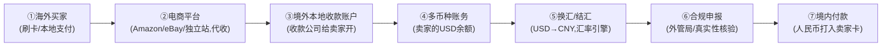
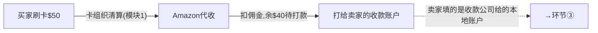
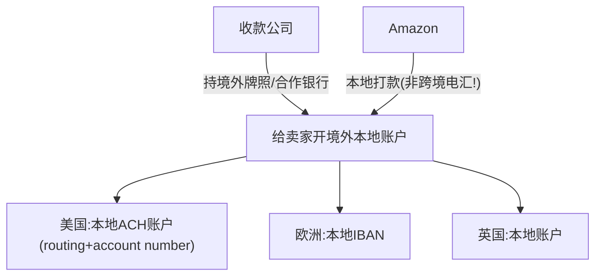
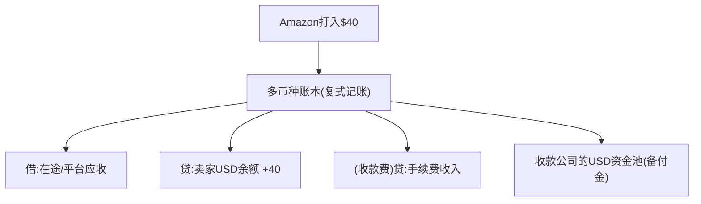
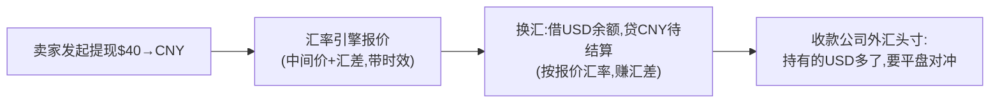
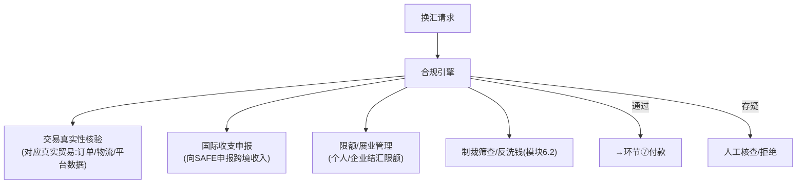
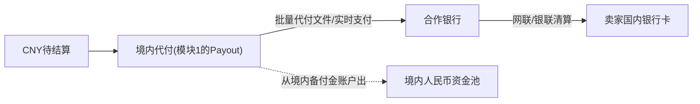
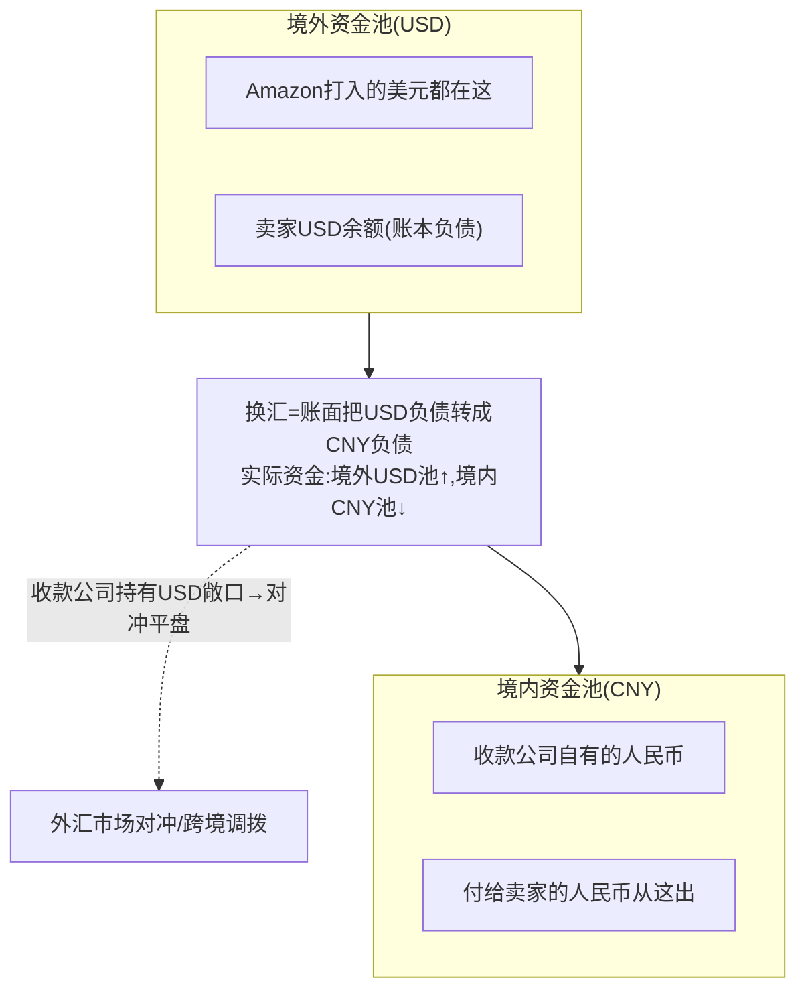
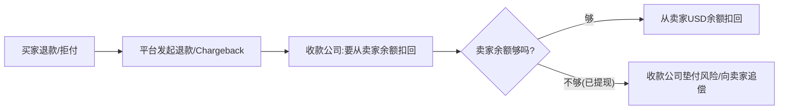
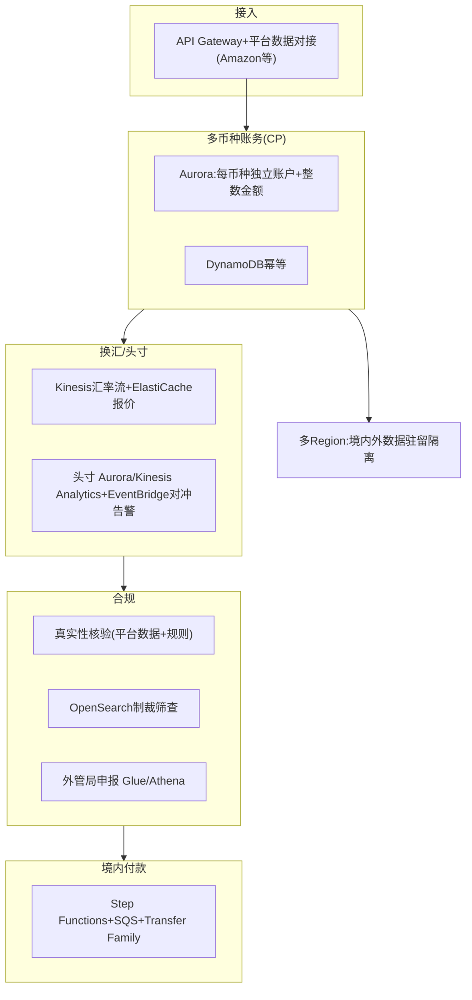

# 模块 3 深化 · 跨境收款全链路：从买家到卖家逐环节剖开

> **学习者**：AWS 技术架构师 · 支付小白
> **本篇目标**：把"一笔跨境电商货款从海外买家到中国卖家"的全链路**逐环节挖透**——每一步的资金流、账务、谁持牌、技术实现、AWS。以连连/PingPong/Airwallex 为例。这是直击"和跨境收款公司深度交流"目标的实战深化。
> **前置**：模块3 业务篇 `03-crossborder-business.md`（§14.2 案例 + §13 中国出海）、模块1深化01b(跨境收款=跨境PayFac)
> **组织方式**：top-down 全链路。零散追问见 FAQ。
> 标注：🔧 通用 · ☁️ AWS · 📌 关键 · ⚠️ 合规/坑点 · 🎯 交流要点
> ⚠️ **可信度**：SAFE 汇发〔2019〕13号、收款服务商"两段式"已核查（来源见业务篇 `03-crossborder-business.md` 附A [10]）；各公司具体牌照/费率见企业画像 `03c-crossborder-players/`，本文为机制层讲解(🔧公知级)。

---

## 1. 全景：一笔货款的完整链路

📌 跨境收款公司（连连/PingPong/Airwallex/Payoneer/万里汇）的本质（模块1深化01b）：**跨境 PayFac + 多币种账户 + 换汇 + 多国牌照**。它把一笔"真跨境"拆成"**境外收 + 境内付 + 中间平头寸**"。

> 🎯 **核心洞察**：钱**从未真正"飞过国境"**——美元始终在美国银行体系内（步骤①-④），人民币始终在中国境内（步骤⑦），中间靠收款公司**自己平外汇头寸**缝合。这就是为什么它比 SWIFT 电汇快、便宜（避开代理行接力）。下面逐环节剖开。

---

## 2. 环节①②：海外买家付款 → 平台代收

🔧 **发生了什么**：买家在 Amazon 刷卡（走卡组织，模块1）或用本地支付方式。**平台（Amazon）先代收**全部货款，扣除平台佣金后，把卖家应得部分准备打给卖家。

📌 **关键**：此时收款公司还没出现——是**平台**在代收。收款公司的角色从"平台要把钱打给卖家"开始（卖家把收款账户填成收款公司给的账户）。

> 🎯 **交流要点**：能区分"平台代收(Amazon)"和"收款公司收款"两个阶段——很多人以为收款公司从买家那收钱，其实是从**平台的卖家打款**那一环接入。

📌 **谁是主商户、谁是子商户？（PayFac 结构，呼应模块1 §4.6）**：
- **主商户(master merchant) = 收款公司（连连）**：在境外注册的"大商户"。
- **子商户(sub-merchant) = 中国卖家**：挂在收款公司主商户号下。
- ⚠️ **中国卖家的双重身份**：在 **Amazon 眼里**是"Amazon 平台卖家"（链路A，Amazon 收单，连连不参与）；在 **连连眼里**是"连连的子商户"（链路B，连连 PayFac）。**两条链路，"商户"指代不同**——连连只在链路B（卖家收款）出现，不碰买家付款那段。这是跨境收款里最容易绕晕的点。

---

## 3. 环节③：境外本地收款账户（收款公司的核心产品）

📌 **这是收款公司最核心的产品**：给中国卖家开一个**境外本地账户**（美国的 ACH/Routing 账户、欧洲的 IBAN 等），让 Amazon 能像给本地卖家打款一样把美元打进来。

🔧 **为什么是"本地账户"是关键**：
- Amazon 给这个账户打款，对 Amazon 来说是**美国境内的本地转账（ACH）**——快、便宜、Amazon 无感知。
- 美元此时**进入收款公司在美国的银行账户体系**（收款公司持美国 MSB/MTL 牌照或合作持牌银行）。
- ⚠️ **钱还在美国境内，没出境**——这是"两段式"的第一段。

📌 **谁持牌**（机制层，具体以各公司披露为准）：
- 美国：MSB（Money Services Business）注册 / 各州 MTL（Money Transmitter License）
- 欧盟：EMI（电子货币机构）；英国：FCA EMI；香港：MSO；新加坡：MAS MPI
- 中国境内：SAFE 跨境外汇业务资质
> 📖 Airwallex 等各家多国牌照矩阵已逐家 deep-research 核查，详见企业画像 `03c-crossborder-players/airwallex.md`（含英FCA EMI/荷兰DNB EMI/新MAS MPI/港MSO/美40州MTL 等）。

☁️ **AWS**：境外本地账户的管理（账户开立、状态、与各国合作银行对接）= 商户管理系统(Aurora)+多区域部署(就近合规)+各国银行接口(ECS网关)。

> 🎯 **交流杀手锏**：能讲"收款公司的核心产品是境外本地收款账户，让平台打款变成本地转账而非跨境电汇"——这是理解整个商业模式的钥匙。多国本地账户矩阵 = 它的核心资产和牌照护城河。

---

## 4. 环节④：多币种账务（卖家的余额）

📌 美元进来后，记在卖家的**多币种账户余额**里（卖家可能同时有 USD/EUR/GBP 余额）。这是模块3技术篇讲的多币种账本。

🔧 **关键账务点**：
- 每个卖家、每个币种**独立余额**，复式记账（模块6.3）。
- 金额用**整数最小单位**（美分），绝不用浮点（模块3/6.3）。
- 卖家的钱沉淀在收款公司的**境外资金池（备付金）**——这是浮存收益来源(模块3三板斧)，也是合规重点(隔离保管)。
- ⚠️ 卖家此时看到的是"USD 余额"，还没换成人民币——**换汇是卖家主动发起的下一步**。

☁️ **AWS**：多币种账本=Aurora(每币种独立账户表,整数金额)+DynamoDB(高频余额读)+QLDB理念/CloudTrail(审计)。

---

## 5. 环节⑤：换汇/结汇（汇差是核心利润）

📌 卖家在 App 点"提现"，选择把 USD 换成 CNY。收款公司的**汇率引擎**报价（中间价+汇差），换汇。

🔧 **关键**（模块3技术篇汇率引擎）：
- **汇差是最大、最隐蔽的利润**：给卖家的汇率 ≠ 银行间中间价，差价就是收益（往往比手续费大）。
- **外汇头寸管理**：收款公司"境外收一堆美元、境内付人民币"，中间有美元敞口，要用远期/即期**对冲平盘**。
- **报价时效**：汇率秒级变，报价有有效期。

☁️ **AWS**：汇率引擎=Kinesis(多源汇率流)+ElastiCache(低延迟报价)+Lambda(汇差计算)；头寸=Aurora/Kinesis Analytics实时净敞口+EventBridge对冲告警。

> 🎯 **交流要点**：能讲"汇差=给客户汇率与中间价的差，是收款公司最大利润；外汇头寸要对冲平盘"——直击其盈利模式和风险管理核心。

---

## 6. 环节⑥：合规申报（外管局/真实性核验，最硬的一环）

📌 ⚠️ **这是中国跨境收款最硬的合规环节**。换汇结汇涉及**外汇管制**，收款公司必须向**外管局(SAFE)**申报，并核验交易真实性。

🔧 **关键合规点**（SAFE 汇发〔2019〕13号）：
- **交易真实性**：跨境收入必须对应**真实贸易**（有订单、物流、平台交易数据佐证）——防虚假交易洗钱/套现。这是收款公司对接 Amazon 等平台拿交易数据的重要原因。
- **国际收支申报**：向 SAFE 系统申报每笔跨境收支。
- **限额与展业**：个人结汇有年度便利化额度，企业按贸易背景。
- ⚠️ 这是收款公司的**牌照护城河和技术重头**——合规做不好直接吊销资质。

☁️ **AWS**：真实性核验=对接平台数据(API)+规则引擎(Lambda)；制裁筛查=OpenSearch(模糊匹配,模块3)；申报数据管道=Glue/Athena;Textract/Bedrock核验单据(reference KYB案例)。

> 🎯 **交流杀手锏**：能讲"跨境收款的命门是合规——交易真实性核验(对应真实贸易)+外管局申报+限额展业"，并指出"这是为什么收款公司要深度对接平台交易数据"——是和中国跨境收款公司交流最显专业的点。

---

## 7. 环节⑦：境内付款（人民币到卖家卡）

📌 合规通过后，收款公司通过**境内牌照+合作银行**把人民币打到卖家国内银行卡。这是"两段式"的第二段——**境内付款**。

🔧 **关键**：
- 这一段就是模块1技术篇 §4.7 讲的**Payout（境内代付）**——批量代付走网联/人行小额，或实时支付。
- 钱从收款公司的**境内人民币备付金账户**出（客户资金隔离，中国集中存管央行）。
- ⚠️ **两段式的本质**：境外那段(USD)和境内这段(CNY)**资金不直接连**——收款公司在两边各有资金池，靠换汇+头寸对冲在内部"缝合"。卖家拿到人民币，但那笔美元其实留在了境外资金池(等收款公司平盘)。

☁️ **AWS**：境内Payout=Step Functions编排+SQS重试+Transfer Family(银行文件)+Aurora(备付金账本)，复用模块1 §4.7架构。

---

## 8. 全链路账务视角：钱的"两个池子"

📌 把全链路从账务看，关键是理解收款公司维护**两个资金池**：

> 📌 **第一性**：卖家"提现到账人民币"的瞬间，**没有美元跨境**——收款公司用**自己境内的人民币**先付给卖家，自己**留下境外的美元**（形成美元头寸，再择机对冲或合规调拨回境内）。这就是"两段境内+内部换汇"的资金真相。
>
> 🎯 这解释了收款公司为什么需要**两边的资金池+牌照+外汇头寸管理能力**——它本质是在做"垫资+换汇+头寸管理"的金融生意，不只是"通道"。

---

## 9. 反向链路：跨境退款与拒付怎么处理

⚠️ 正向讲完，别忘反向——跨境的退款/拒付（模块1拒付+模块3跨境）更复杂：

🔧 **关键风险**：如果卖家已经把钱提现结汇走了，又发生买家拒付——收款公司面临**垫付/追偿风险**（钱已换成人民币付给卖家，但美元那头被买家要回）。这是跨境收款公司的核心风险，要靠**风控+保证金+提现延迟(rolling reserve)**管理。

> 🎯 **交流要点**：能问"你们怎么处理卖家提现后又发生拒付的垫付风险？rolling reserve 怎么设？"——直击跨境收款公司的核心风控痛点。

---

## 10. 全链路 AWS 参考架构

| 环节 | ☁️ AWS |
|---|---|
| 平台数据对接/受理 | API Gateway + ECS 各平台接口 |
| 多币种账务 | Aurora(每币种独立,整数) + DynamoDB(幂等) |
| 汇率引擎/头寸 | Kinesis + ElastiCache + Aurora/Kinesis Analytics + EventBridge |
| 真实性核验 | 平台数据API + 规则引擎(Lambda) + Textract/Bedrock(单据) |
| 制裁筛查 | OpenSearch(模糊匹配) |
| 外管局申报 | Glue/Athena 数据管道 |
| 境内Payout | Step Functions+SQS+Transfer Family+Aurora备付金 |
| 数据驻留 | 多Region隔离(境内数据不出境)+PrivateLink |
| 反向拒付/风控 | Fraud Detector+保证金账户(Aurora) |

> 🎯 **交流杀手锏**：能给出跨境收款全链路的 AWS 方案——**境内外多Region数据驻留 + Aurora多币种账本 + Kinesis汇率头寸 + OpenSearch制裁 + 平台数据真实性核验 + Step Functions境内Payout + 拒付垫付风控**——并讲清每环节的合规/资金/技术，是 AWS SA 切入跨境收款公司最有杀伤力的能力。

---

## 11. 本篇小结（背下来）

1. **全链路七环节**：买家付→平台代收→境外本地账户→多币种账务→换汇→合规申报→境内付款。
2. **核心产品=境外本地收款账户**：让平台打款变本地转账(非跨境电汇)，多国账户矩阵是核心资产。
3. **两个资金池**：境外USD池+境内CNY池，换汇时账面转移、实际资金不跨境，收款公司平头寸缝合。
4. **钱从未真飞国境**：卖家提现到账人民币时，用收款公司境内人民币先付，美元留境外形成头寸。
5. **汇差是最大利润**+外汇头寸要对冲；浮存来自境外资金池沉淀。
6. **合规是命门**：交易真实性核验(对应真实贸易,深度对接平台数据)+外管局申报+限额展业(SAFE 13号)。
7. **反向风险**：卖家提现后买家拒付→垫付/追偿，靠风控+保证金+rolling reserve。
8. **AWS全链路**：多Region数据驻留+Aurora多币种+Kinesis汇率头寸+OpenSearch制裁+平台数据核验+Step Functions境内Payout。

---

## 12. 通向

- **跨境业务/技术全景** → 模块3 `03-crossborder-business/tech-aws.md`
- **收款公司=跨境PayFac产业链定位** → 模块1深化 `01-cards-business.md` §4.6
- **带引用的来源清单(SAFE/G20/新兴技术)** → `03-crossborder-business.md` 附A
- **跨境头部企业画像(13家)** → `03c-crossborder-players/`
- **稳定币能否绕开这套(on/off-ramp合规)** → 模块4 + `stablecoin_cross_border_compliance.md`
- **合规/风控体系** → 模块6.1/6.2

---

## 附：常见追问（FAQ）

**Q：收款公司到底有没有"跨境汇款"？钱怎么从美国到中国的？**
A：严格说，**单笔交易里钱没有跨境**——美元留在境外资金池，人民币从境内资金池出。收款公司用"境外收美元、境内付人民币"两段境内操作 + 内部换汇平头寸，**等效**实现了跨境。真正的跨境资金调拨（把境外沉淀的美元合规调回境内，或反向）是收款公司**批量、择机、合规**做的（走正规跨境通道+外管局合规），和单个卖家的提现解耦。这就是为什么卖家提现能"快"——不用等真实跨境清算。

**Q：为什么收款公司比银行电汇便宜那么多？**
A：三个原因。①**避开代理行接力**：传统电汇走 SWIFT+多级代理行，每级抽费；收款公司两段境内，没有中间行。②**规模化轧差**：大量卖家的收付可以内部轧差，减少实际跨境调拨。③**汇差替代明费**：表面费率低，利润藏在汇差里。本质是用"规模化的两段境内+内部换汇+头寸管理"替代"一笔真跨境电汇"。

**Q：rolling reserve（滚动保证金）是什么？**
A：收款公司为防"卖家提现后买家拒付导致垫付损失"，会**扣留卖家一定比例的资金一段时间**（如扣 10%、留 90 天）作为风险准备金。期满无拒付才释放。这和模块1收单的拒付风险管理同理——跨境因为拒付追偿更难（跨境、卖家可能跑路），rolling reserve 更重要。高风险卖家/类目的 reserve 比例更高。

**Q：稳定币能取代这套跨境收款吗？**
A：理论上稳定币"转账即结算"可以让美元以 USDC 形式秒到中国卖家——但卡在 **off-ramp**（模块4）：中国卖家最终要人民币落地，撞上外汇管制，境内人民币↔稳定币换汇"合规不可行"。所以稳定币能优化"境外那段"（美元→USDC 跨境快），但"落地人民币"这最后一段仍要走传统结汇+外管局合规——和现在收款公司做的事一样。详见 `stablecoin_cross_border_compliance.md`。
