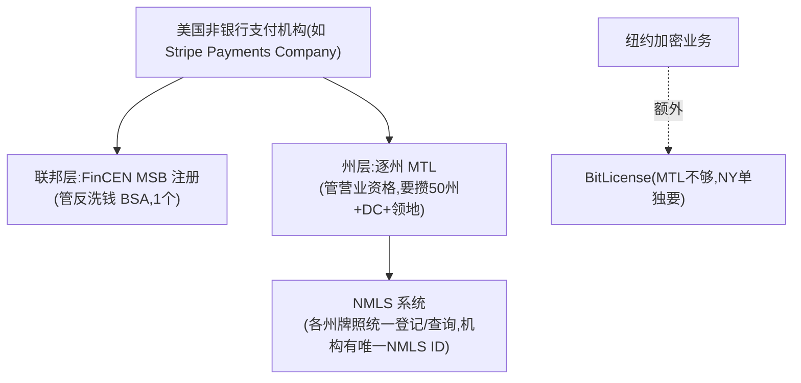
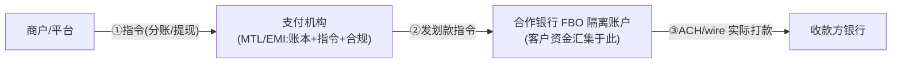

# 支付牌照术语速查（MTL / EMI / MSB / NMLS / passporting / FBO …）

> **用途**：`02c-epayment-players/` 与 `03c-crossborder-players/` 各公司画像里反复出现的牌照/合规术语，统一在此讲透。各画像的"牌照与资质"节用一句话指向本文，不重复解释。
> **核心心智模型**（先记住这一条，再看细节）：
> > 📌 **支付机构牌照 = "有资格替别人管钱、按指令划钱、并承担反洗钱合规"的许可；但物理上的钱永远走银行轨道。** 所以全世界的非银行支付公司(Stripe/连连/Airwallex/PingPong…)都是"**持牌的账本+指令+合规层 + 挂靠银行碰钱**"——这是模块0"支付=在账本上改数字、钱不移动"在牌照层面的体现。
> **标注**：🔧 行业公知机制 · 📌 关键 · ⚠️ 易混淆

---

## 1. 一张总表：常见牌照速查

| 缩写 | 全称 | 法域 | 是什么/能做什么 | 类比 |
|---|---|---|---|---|
| **MTL** | Money Transmitter License 货币转移牌照 | 美国(**逐州**) | 州级营业牌照，允许"替别人接收并转移资金"。要逐州申请(50州+DC+领地) | 各州的"汇款营业执照" |
| **MSB** | Money Services Business 货币服务业 | 美国(联邦) | **FinCEN 注册**(不是营业牌照)，主要是反洗钱(BSA)合规登记 | 联邦"反洗钱户口" |
| **NMLS** | Nationwide Multistate Licensing System | 美国 | **不是牌照，是牌照登记/查询系统**。每机构一个 NMLS ID，可查它在哪些州持牌 | 牌照"户口本系统" |
| **EMI** | Electronic Money Institution 电子货币机构 | 欧盟/英国 | 比 MTL 权限大：发行电子货币+持有客户余额+**收单(acquire)**+支付发起/账户信息。一张可经 passporting 覆盖全 EEA | "支付全能牌"(差银行的存贷) |
| **PI** | Payment Institution 支付机构 | 欧盟/英国 | 比 EMI 窄：只能做支付处理，**不能发行电子货币、不能持久持有客户余额** | "支付处理牌"(权限受限) |
| **passporting** | 牌照护照 | 欧盟 EEA | "一国持牌、全 EEA(30国)通行"机制——美国没有 | 欧盟单一市场红利 |
| **MSO** | Money Service Operator 金钱服务经营者 | 香港 | 香港海关发，做货币兑换/汇款 | 香港"汇兑牌" |
| **MPI** | Major Payment Institution 大型支付机构 | 新加坡 | 新加坡《支付服务法 PSA》下的支付牌照(无交易额上限) | 新加坡"大额支付牌" |
| **BitLicense** | 虚拟货币牌照 | 美国纽约州 | 做加密/稳定币业务，NY 单独要这张(MTL 不够) | 纽约"加密专牌" |
| **EMD/PSD2** | 电子货币指令/支付服务指令2 | 欧盟 | EMI/PI 遵循的监管框架(资金隔离、SCA 强认证等) | 欧盟"支付监管法" |
| **MiCA** | Markets in Crypto-Assets | 欧盟 | 加密资产/稳定币的欧盟统一监管(发行须授权) | 欧盟"加密新规" |
| **GENIUS Act** | (美国 2025 稳定币法) | 美国 | 稳定币储备/兑付/披露义务 | 美国"稳定币法" |
| **SAFE 13号** | 汇发〔2019〕13号 | 中国 | 国家外汇管理局《支付机构外汇业务管理办法》，跨境收款合规底座 | 中国"跨境外汇支付办法" |

---

## 2. 美国为什么这么麻烦：联邦注册 + 逐州牌照"双层结构" 🔧

美国**没有联邦统一支付牌照**，所以是双层：

> 📌 **一句话**：美国支付机构 = **FinCEN MSB 注册(反洗钱) + 各州 MTL(营业资格)**，NMLS 是查这些牌照的"户口本系统"。这就是为什么 Stripe 要在几十个州各拿一张 MTL。
> 📌 **对比欧盟**：欧盟一张 EMI 经 **passporting 覆盖 30 国**——这解释了为什么支付公司把欧洲牌照放在爱尔兰/卢森堡(一张管全欧)、美国却要逐州持牌。**美国碎片化 vs 欧盟单一市场**是牌照布局的根本分野。

---

## 3. "接收并按指令转移/汇出资金"——MTL 到底怎么运作？ 🔧

这是 MTL/EMI 的核心权限，拆三问：

**① 接收谁的指令？** —— Stripe/连连这类机构的**客户(商户/平台)**。
- 例：Shopify(平台)指令"这笔 $100 分 $97 给卖家、留 $3 佣金"→ 机构按指令**分账**；商户指令"提现 $5000 到我银行卡"→ 机构按指令**payout**。

**② 如何转移/汇出？** —— ⚠️ **机构自己不是银行、没有央行账户**，MTL 只给"法律资格替客户持有并按指令划转"，**物理上的钱永远走银行轨道(ACH/电汇/卡清算)**。机构在自己账本记"哪笔属于谁"，要划出时通过合作银行实际打款。

**③ 和银行如何合作？—— FBO 账户** 📌
- 机构在合作银行开 **FBO 账户(For Benefit Of，"为客户利益持有"的隔离账户)**：所有客户的钱**汇集**在此(资金隔离，不与机构自有资金混)，机构在自己账本记每个客户份额。
- **银行提供"碰钱的管道+最终结算"，支付机构提供"按客户指令记账分配的账本+合规"**。

> 📌 **这就是"持牌支付机构 + 合作银行"模式**——和模块3 跨境收款、模块2 电子支付逻辑完全一致：**支付机构=账本+指令+合规层，银行=碰钱+最终结算层**。

---

## 4. 需要银行牌照的功能：必须挂靠合作银行 🔧

支付牌照(MTL/EMI)**不等于银行牌照**——吸收存款/放贷/发卡这些要银行资质的事，非银行支付公司**统统挂靠持牌合作银行**，自己只做技术+项目管理+资金转移层。以 Stripe 为例(其他公司同理)：

| 功能 | 为什么要银行 | 怎么挂靠 |
|---|---|---|
| **存款账户(如 Stripe Treasury)** | 吸收存款是银行专属 | 资金存合作银行 FBO 账户(如 Fifth Third)，FDIC pass-through，Stripe 非银行 |
| **发卡(Issuing)** | 发卡需卡组织发卡成员资格 | 借**合作发卡行的 BIN(银行识别号)赞助**发卡(如 Celtic/Cross River/Sutton)，机构是项目方、银行是网络成员 |
| **放贷(Capital)** | 放贷需银行/贷款牌照 | 经合作放贷行(如 YouLend/Celtic) |

> 📌 **BIN 赞助**：非银行机构借持牌发卡行的 BIN 发卡——这是为什么 Stripe/连连发卡都要挂合作行。

---

## 5. 各家牌照布局的差异（看画像时的对照锚点）🔧

- **美国逐州 MTL + FinCEN MSB**：Stripe(SPC)、连连(LLPay 全 50 州)、PingPong(NMLS 1572799)、Airwallex(US LLC)、万里汇(AUS Merchant Services 全 50 州)——都走这套。
- **欧盟 EMI(经 passporting 覆盖 EEA)**：Stripe(爱尔兰 C187865)、连连(卢森堡 2024)、Airwallex(荷兰)、PingPong(卢森堡 B211775)、万里汇(荷兰)——多放爱尔兰/卢森堡/荷兰。
- **中国境内央行《支付业务许可证》**：连连(连连银通)、PingPong(收购信航支付)、Payoneer(收购易联支付)、万里汇(⚠️ 无自有、靠合作)——拿中国牌照难，多靠收购。
- **境内银行卡清算牌照**：仅连连(经合资连通 LianTong)——中国首张且唯一中外合资清算牌照，极稀缺。
- **稳定币/虚拟资产牌照**：Stripe(Bridge 逐州 MTL+虚拟货币+波兰 KNF)、连连(香港 SFC VATP)——新兴前沿。

> 🎯 **交流要点**：能说清"美国逐州 MTL+联邦 MSB vs 欧盟一张 EMI passporting 全 EEA vs 中国央行牌照靠收购"的牌照布局逻辑，并指出"支付机构持牌但碰钱靠合作银行 FBO 账户"——是和支付公司聊合规/牌照最显专业的底层认知。

---

## 引用本文的画像
- Stripe `02c-epayment-players/stripe.md` §4
- 连连/PingPong/Airwallex/万里汇/Payoneer 等 `03c-crossborder-players/`
- 跨境牌照体系见 `03-crossborder-business.md` §13(中国出海 SAFE)、`03b §6`(合规体系)
