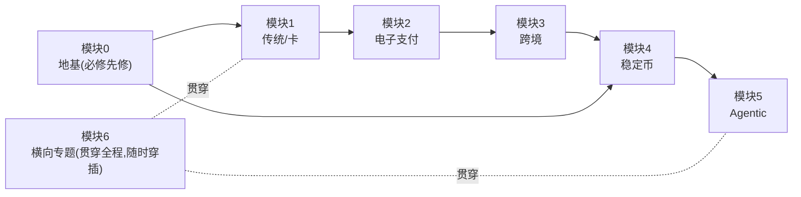

# 支付研究学习路径总纲（面向 AWS 技术架构师）

> **学习者画像**：AWS 技术架构师 · 支付领域小白
> **最终目标**：能与支付公司（特别是跨境支付公司）深度交流**业务场景**与**技术架构方案**
> **方法论**：第一性原理——每个概念都回答「解决什么问题 / 本质是什么 / 各方关注什么 / 价值在哪」
> **配套速查**：全部术语的"所属模块+一句话定义"见 `支付概念全景地图.md`
> 最后更新：2026-06-04

---

## 一、设计原则（怎么学）

### 1. 业务轨 × 技术轨分离
| | 业务轨（Business Track） | 技术轨（Tech Track） |
|---|---|---|
| 回答 | 解决什么问题、参与方与角色、职责、收益模式、护城河 | 通用技术实现 + **AWS 如何支持** |
| 技术 | 只**概要提及**（点到为止） | **单独深入**（架构、组件、AWS 服务映射） |
| 产出 | `*-business.md` | `*-tech.md` |

> 你是 AWS SA，技术轨会特别强调「这个支付能力在 AWS 上用什么服务搭、踩什么坑、合规边界在哪」。

### 2. 时代演进主线（第一性的"为什么"）
每个时代都是为**解决上一时代的遗留痛点**而生。这条链是和支付公司交流时的"认知地图"：

```
地基(钱与账本) → 传统支付 → 互联网电子支付 → 跨境支付 → 稳定币支付 → Agentic Payment
     │             │            │              │            │              │
   什么是钱      银行卡/清结算  网关/三方支付   代理行/SWIFT  链上账本      AI Agent 成为
   账本/信用     四方模型      移动支付        多币种/合规   转账即结算     付款主体
```

### 3. 每个模块的统一结构
- **业务篇**：① 这个时代/概念解决什么问题 ② 参与方与角色全景 ③ 各方职责与收益模式 ④ 护城河（为什么别人抢不走） ⑤ 真实案例 ⑥ 技术挑战概览（引向技术篇）
- **技术篇**：① 核心技术问题 ② 通用架构与组件 ③ 关键流程时序 ④ **AWS 架构方案**（服务映射 + 参考架构 + 合规） ⑤ 与支付公司交流的技术话术要点

---

## 二、完整学习路径（七大模块）

### 模块 0 · 地基：钱、账本、信用与清结算 ⭐必修先修
> 不懂这层，后面全是名词。这是所有支付的"物理定律"。

- **业务**：钱的本质（一般等价物→信用凭证）、账本与复式记账、钱的等级（央行货币>银行存款>私人代币）、清算 vs 结算（finality）、信息流 vs 资金流 vs 商流
- **技术**：账本系统的本质（借贷记账）、幂等、对账、一致性、为什么金融系统偏好"宁可错杀的强一致"
- **AWS**：暂不展开（地基层）
- 状态：☐ 待生成

### 模块 1 · 传统支付：银行卡与四方模型
> 现代支付的骨架，跨境/电子支付都建立在它之上。**发卡与收单是四方模型的左右两端，本模块讲透。**

- **业务篇**：
  - 四方模型五方（发卡行/收单行/卡组织/商户/持卡人）、四方 vs 三方模型
  - **发卡(Issuing)**：服务持卡人一侧——授信、风险、卡产品；**虚拟卡(Virtual Card)** = 发卡的数字化形态（无实体、即时生成、单次/限额，用于线上付款、供应商代付、费控）
  - **收单(Acquiring)**：服务商户一侧——让商户有资格受理卡、把钱收进来；收单机构 vs ISO/支付服务商
  - 交换费(Interchange)激励引擎、授权-清算-结算三段、收益模式(MDR 分账)、护城河(网络效应、双边市场、牌照)
- **技术篇**：
  - ISO 8583 报文、卡 BIN 路由、HSM 与密钥管理、PCI-DSS
  - **受理终端**：**POS**（线下物理受理终端，是收单的入口）、ATM、**SoftPOS**（把普通 NFC 手机变成 POS 终端——去专用硬件、降商户门槛，受理终端的演进）
  - 发卡系统、虚拟卡的 BIN/令牌(tokenization)实现
  - **AWS**：CloudHSM、Payment Cryptography（PIN/卡密钥/EMV）、Nitro Enclaves 处理卡数据、PCI 合规架构
- 关联：`traditional-payment/01-cards-business.md` + `01-cards-tech-aws.md`
- 状态：✅ 已生成（业务篇+技术篇）

### 模块 2 · 互联网时代：电子支付、支付网关与第三方支付
> 核心：**线上没有 POS 机**——支付网关就是"互联网时代的 POS"（线上受理入口）；外加解决"买卖双方互不信任"。

- **业务篇**：
  - **支付网关(Gateway)**：线上受理入口（对应线下 POS 的角色）；支付网关 vs 支付处理器(Processor) vs 收单的分工
  - 第三方支付（支付宝/微信/PayPal/Stripe）、担保交易（解决信任）、聚合支付/聚合收单
  - **收款(Collection)**：帮商户把分散渠道的钱汇集回来（境内收款；**跨境收款见模块3**）
  - 备付金与浮存收益、商业模式、护城河（场景+流量+牌照）
- **技术篇**：支付网关架构、异步通知/回调、对账系统、幂等设计、路由与故障转移、风控引擎接入、令牌化(tokenization)
  - **AWS**：API Gateway + Lambda 支付网关、SQS/EventBridge 异步、DynamoDB 幂等、对账批处理、高可用多区
- 状态：☐ 待生成

### 模块 3 · 跨境支付（重点）
> 你已有基础（traditional-payment 目录）。核心：跨境没有共同账本。

- **业务篇**：代理行(nostro/vostro)、SWIFT、各国清算系统(Fedwire/CHIPS/CHAPS/T2/CIPS)、外汇与汇差、第三方收款商(连连/PingPong/Airwallex/Payoneer)、两段式模式、收益(手续费+汇差+浮存)、合规护城河、G20 路线图
- **技术篇**：SWIFT MT/ISO 20022(pacs.008)、多币种账务、汇率引擎、外汇头寸管理、KYC/AML/制裁筛查系统、跨境对账
  - **AWS**：多区域账务架构、实时汇率管道(Kinesis)、制裁名单筛查(OpenSearch模糊匹配)、合规数据驻留
- 关联：`traditional-payment/` 已有报告/笔记/架构图
- 状态：◐ 部分已有（业务），技术篇待生成

### 模块 4 · 稳定币支付
> 你已有基础（stable-coin 目录）。核心：重造一个全球开放账本。

- **业务篇**：稳定币本质(链上账本+法币锚定)、USDC/USDT/PYUSD/RLUSD、转账即结算、on/off-ramp 接缝、储备与合规(GENIUS法案/香港条例)、CBDC/mBridge、收益模式、与传统体系的竞合
- **技术篇**：区块链账本原理、智能合约、钱包与私钥、链上转账机制、预言机、跨链桥、合规(链上 AML/Travel Rule)
  - **AWS**：Amazon Managed Blockchain、QLDB(账本数据库)、KMS/Nitro 私钥保护、节点托管、链上数据分析
- 关联：`stable-coin/` 已有 3 篇
- 状态：◐ 部分已有，技术篇/AWS篇待生成

### 模块 5 · Agentic Payment（前沿）
> 你已有大量基础（agentic-payment 目录）。核心：AI Agent 成为新的付款主体。

- **业务篇**：Agent 作为付款主体带来的新问题(授权/身份/信任/争议)、各协议格局(Google AP2/UCP、OpenAI×Stripe ACP、Visa TAP、Mastercard Agent Pay、Coinbase x402、Amazon)、商业模式演变、新护城河
- **技术篇**：Agent 支付协议机制、可验证凭证(VC)、意图与授权、x402(HTTP 402 复活)、MCP 与支付、Agent 身份与风控
  - **AWS**：Bedrock AgentCore、AgentCore Payments、Agent 身份、x402 on AWS
- 关联：`agentic-payment/` 已有 8 个协议专题 + 综述 + 风控
- 状态：◑ 大量已有，需提炼"业务+AWS技术"双视角

### 模块 6 · 横向专题（贯穿所有时代）
- **6.1 风控与反欺诈**：规则引擎→ML→Agent原生风控（agentic-payment/10 已有部分）
  - AWS：Fraud Detector、SageMaker、实时特征
- **6.2 合规体系**：KYC/AML/制裁/数据驻留/牌照地图
- **6.3 账务与对账系统**：复式记账、对账、差错处理（金融系统的"心脏"）
  - AWS：QLDB、Aurora、批处理对账
- **6.4 支付系统的非功能性**：高可用、一致性、幂等、限流、资金安全
  - AWS：多区容灾、Saga/事务、DynamoDB 设计
- 状态：☐ 待生成

---

## 三、推荐学习顺序



**建议节奏**：先把**模块 0 地基**啃透（它是和支付公司对话不露怯的根基），再沿时代主线 1→2→3→4→5 推进。横向专题（风控/合规/账务）在主线推进中按需穿插。

---

## 四、产出文件组织

每个模块的材料放入对应维度目录，业务/技术分文件：
```
traditional-payment/
  00-foundation-business.md      模块0 地基(业务)
  00-foundation-tech.md          模块0 地基(技术)
  01-cards-business.md           模块1 银行卡(业务)
  01-cards-tech-aws.md           模块1 银行卡(技术+AWS)
  02-epayment-business.md        模块2 电子支付(业务)
  02-epayment-tech-aws.md        模块2 电子支付(技术+AWS)
  ...(模块3 跨境已有报告/笔记/图)
stable-coin/        模块4 业务/技术
agentic-payment/    模块5 业务/技术(已有大量协议研究)
_topics/            模块6 横向专题(风控/合规/账务/非功能性) ← 新建跨维度目录
```

> 每生成一份材料，按 `CLAUDE.md` 规则更新 `INDEX.md`。

---

## 五、进度追踪

| 模块 | 业务篇 | 技术+AWS篇 |
|---|---|---|
| 0 地基 | ✅ | ✅ |
| 1 传统/卡 | ✅ | ✅ |
| 2 电子支付 | ☐ | ☐ |
| 3 跨境 | ◐ 已有报告 | ☐ |
| 4 稳定币 | ◐ 已有研究 | ☐ |
| 5 Agentic | ◑ 已有协议专题 | ☐ |
| 6 横向专题 | ☐ | ☐ |

图例：☐ 未开始 · ◐ 部分 · ◑ 较多 · ✅ 完成
