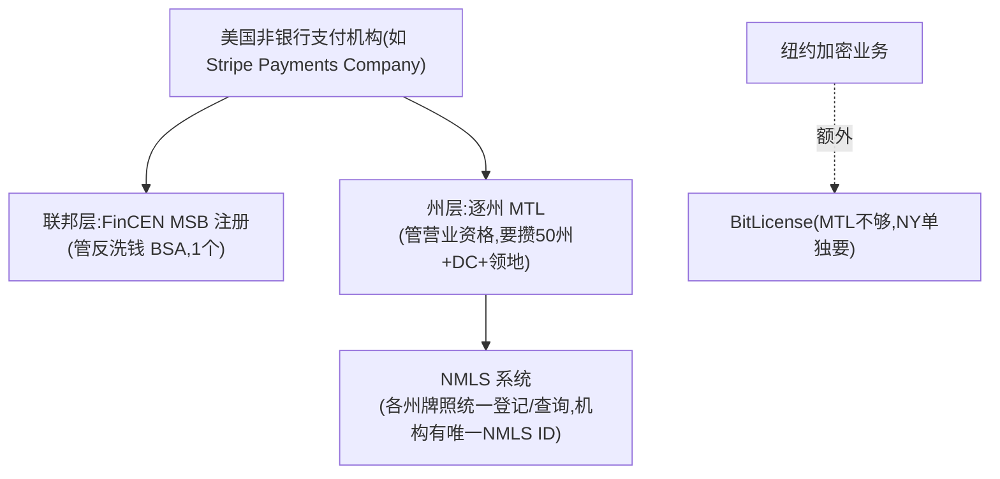
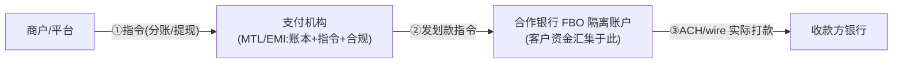
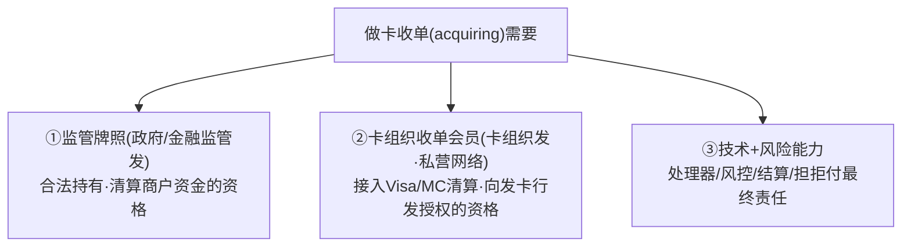

# 支付术语速查（MTL / EMI / MSB / NMLS / passporting / FBO + 监管机构 + 合规术语）

> **用途**：`02c-epayment-players/` 与 `03c-crossborder-players/` 各公司画像、`03-crossborder-*` 跨境篇里反复出现的**牌照（§1-5）/ 监管机构（§6）/ 合规术语（§7）**，统一在此讲透。各画像的"牌照与资质"节用一句话指向本文，不重复解释。
> **核心心智模型**（先记住这一条，再看细节）：
> > 📌 **支付机构牌照 = "有资格替别人管钱、按指令划钱、并承担反洗钱合规"的许可；但物理上的钱永远走银行轨道。** 所以全世界的非银行支付公司(Stripe/连连/Airwallex/PingPong…)都是"**持牌的账本+指令+合规层 + 挂靠银行碰钱**"——这是模块0"支付=在账本上改数字、钱不移动"在牌照层面的体现。
> **标注**：🔧 行业公知机制 · 📌 关键 · ⚠️ 易混淆

---

## 1. 一张总表：常见牌照速查

| 缩写 | 全称 | 法域 | 是什么/能做什么 | 类比 |
|---|---|---|---|---|
| **MTL** | Money Transmitter License 货币转移牌照 | 美国(**逐州**) | 州级营业牌照，允许"替别人接收并转移资金"。要逐州申请(50州+DC+领地) | 各州的"汇款营业执照" |
| **MSB** | Money Services Business 货币服务业 | 美国(联邦) | **FinCEN 注册**(不是营业牌照)，主要是反洗钱(BSA)合规登记 | 联邦"反洗钱户口" |
| **NMLS** | Nationwide Multistate Licensing System | 美国 | **不是牌照，是牌照登记/查询系统**。每机构一个 NMLS ID，可查它在哪些州持牌 | 牌照"户口本系统" |
| **EMI** | Electronic Money Institution 电子货币机构 | 欧盟/英国 | 比 MTL 权限大：发行电子货币+持有客户余额+**收单(acquire)**+支付发起/账户信息。一张可经 passporting 覆盖全 EEA | "支付全能牌"(差银行的存贷) |
| **PI** | Payment Institution 支付机构 | 欧盟/英国 | 比 EMI 窄：只能做支付处理，**不能发行电子货币、不能持久持有客户余额** | "支付处理牌"(权限受限) |
| **passporting** | 牌照护照 | 欧盟 EEA | "一国持牌、全 EEA(30国)通行"机制——美国没有 | 欧盟单一市场红利 |
| **MSO** | Money Service Operator 金钱服务经营者 | 香港 | 香港海关发，做货币兑换/汇款 | 香港"汇兑牌" |
| **MPI** | Major Payment Institution 大型支付机构 | 新加坡 | 新加坡《支付服务法 PSA》下的支付牌照(无交易额上限) | 新加坡"大额支付牌" |
| **BitLicense** | 虚拟货币牌照 | 美国纽约州 | 做加密/稳定币业务，NY 单独要这张(MTL 不够) | 纽约"加密专牌" |
| **EMD/PSD2** | 电子货币指令/支付服务指令2 | 欧盟 | EMI/PI 遵循的监管框架(资金隔离、SCA 强认证等) | 欧盟"支付监管法" |
| **MiCA** | Markets in Crypto-Assets | 欧盟 | 加密资产/稳定币的欧盟统一监管(发行须授权) | 欧盟"加密新规" |
| **GENIUS Act** | (美国 2025 稳定币法) | 美国 | 稳定币储备/兑付/披露义务 | 美国"稳定币法" |
| **SAFE 13号** | 汇发〔2019〕13号 | 中国 | 国家外汇管理局《支付机构外汇业务管理办法》，跨境收款合规底座 | 中国"跨境外汇支付办法" |

---

## 2. 美国为什么这么麻烦：联邦注册 + 逐州牌照"双层结构" 🔧

美国**没有联邦统一支付牌照**，所以是双层：

> 📌 **一句话**：美国支付机构 = **FinCEN MSB 注册(反洗钱) + 各州 MTL(营业资格)**，NMLS 是查这些牌照的"户口本系统"。这就是为什么 Stripe 要在几十个州各拿一张 MTL。
> 📌 **对比欧盟**：欧盟一张 EMI 经 **passporting 覆盖 30 国**——这解释了为什么支付公司把欧洲牌照放在爱尔兰/卢森堡(一张管全欧)、美国却要逐州持牌。**美国碎片化 vs 欧盟单一市场**是牌照布局的根本分野。

---

## 3. "接收并按指令转移/汇出资金"——MTL 到底怎么运作？ 🔧

这是 MTL/EMI 的核心权限，拆三问：

**① 接收谁的指令？** —— Stripe/连连这类机构的**客户(商户/平台)**。
- 例：Shopify(平台)指令"这笔 $100 分 $97 给卖家、留 $3 佣金"→ 机构按指令**分账**；商户指令"提现 $5000 到我银行卡"→ 机构按指令**payout**。

**② 如何转移/汇出？** —— ⚠️ **机构自己不是银行、没有央行账户**，MTL 只给"法律资格替客户持有并按指令划转"，**物理上的钱永远走银行轨道(ACH/电汇/卡清算)**。机构在自己账本记"哪笔属于谁"，要划出时通过合作银行实际打款。

**③ 和银行如何合作？—— FBO 账户** 📌
- 机构在合作银行开 **FBO 账户(For Benefit Of，"为客户利益持有"的隔离账户)**：所有客户的钱**汇集**在此(资金隔离，不与机构自有资金混)，机构在自己账本记每个客户份额。
- **银行提供"碰钱的管道+最终结算"，支付机构提供"按客户指令记账分配的账本+合规"**。

> 📌 **这就是"持牌支付机构 + 合作银行"模式**——和模块3 跨境收款、模块2 电子支付逻辑完全一致：**支付机构=账本+指令+合规层，银行=碰钱+最终结算层**。

### 3.1 做卡收单(acquiring)需要什么资质？——三层，分属不同发证方 🔧

> 🔑 **高频误区：以为"有了支付牌照(MTL/EMI/MPI)就能做卡收单"。不对**——做收单要**三层资格，且①②来自不同发证方**：

| 层 | 谁发 | 解决什么 | 形态(因法域而异) |
|---|---|---|---|
| **① 监管牌照** | **政府/金融监管** | 合法持有·清算商户资金 | 美 **MTL+MSB**(⚠️范围**不含**卡收单)；欧/英 **EMI/PI**(范围**含** acquiring)；新 **MPI**(范围含)；中 **《支付业务许可证·银行卡收单类》**(真有"收单"字样)；港 **MSO**(不含) |
| **② 卡组织收单会员** | **卡组织(Visa/MC，私营网络)** | 接入卡网络清算、向发卡行发授权 | **Principal Member / Acquirer** 资格；自己拿不到→**挂靠 sponsor 收单行**(=PayFac/ISO 模式) |
| **③ 技术+风险** | (自身能力) | 处理器/风控/KYB/担拒付最终责任 | 收单行对资金清算负**最终责任** |

- 🔑 **三个关键点**：① **监管牌照范围不一定含收单**(美 MTL、港 MSO 就不含；欧 EMI、新 MPI 含)；② **即便范围含，还要第②层卡组织会员**才能真受理卡——**①来自政府、②来自卡组织，是两个不同发证方，都要齐**；③ 拿不齐②就**挂靠 sponsor 收单行**(`card-payment/01-cards-business §4.3.2`)。
- 💡 **实证(连连)**：连连有一堆①(MTL/EMI/MPI/MSO/DFSA)，但②**只在中国大陆+新加坡是卡组织主会员**(招股书)、其余法域**靠挂靠 sponsor**——所以"有 MTL/EMI 就能收单"只在新加坡勉强成立，美/欧即便牌照范围含收单也得挂靠(详见 `crossborder-payment/03c-crossborder-players/lianlian.md §4.2.1`)。

---

## 4. 需要银行牌照的功能：必须挂靠合作银行 🔧

支付牌照(MTL/EMI)**不等于银行牌照**——吸收存款/放贷/发卡这些要银行资质的事，非银行支付公司**统统挂靠持牌合作银行**，自己只做技术+项目管理+资金转移层。以 Stripe 为例(其他公司同理)：

| 功能 | 为什么要银行 | 怎么挂靠 |
|---|---|---|
| **存款账户(如 Stripe Treasury)** | 吸收存款是银行专属 | 资金存合作银行 FBO 账户(如 Fifth Third)，FDIC pass-through，Stripe 非银行 |
| **发卡(Issuing)** | 发卡需卡组织发卡成员资格 | 借**合作发卡行的 BIN(银行识别号)赞助**发卡(如 Celtic/Cross River/Sutton)，机构是项目方、银行是网络成员 |
| **放贷(Capital)** | 放贷需银行/贷款牌照 | 经合作放贷行(如 YouLend/Celtic) |

> 📌 **BIN 赞助**：非银行机构借持牌发卡行的 BIN 发卡——这是为什么 Stripe/连连发卡都要挂合作行。

---

## 5. 各家牌照布局的差异（看画像时的对照锚点）🔧

- **美国逐州 MTL + FinCEN MSB**：Stripe(SPC)、连连(LLPay 全 50 州)、PingPong(NMLS 1572799)、Airwallex(US LLC)、万里汇(AUS Merchant Services 全 50 州)——都走这套。
- **欧盟 EMI(经 passporting 覆盖 EEA)**：Stripe(爱尔兰 C187865)、连连(卢森堡 2024)、Airwallex(荷兰)、PingPong(卢森堡 B211775)、万里汇(荷兰)——多放爱尔兰/卢森堡/荷兰。
- **中国境内央行《支付业务许可证》**：连连(连连银通)、PingPong(收购信航支付)、Payoneer(收购易联支付)、万里汇(⚠️ 无自有、靠合作)——拿中国牌照难，多靠收购。
- **境内银行卡清算牌照**：仅连连(经合资连通 LianTong)——中国首张且唯一中外合资清算牌照，极稀缺。
- **稳定币/虚拟资产牌照**：Stripe(Bridge 逐州 MTL+虚拟货币+波兰 KNF)、连连(香港 SFC VATP)——新兴前沿。

> 🎯 **交流要点**：能说清"美国逐州 MTL+联邦 MSB vs 欧盟一张 EMI passporting 全 EEA vs 中国央行牌照靠收购"的牌照布局逻辑，并指出"支付机构持牌但碰钱靠合作银行 FBO 账户"——是和支付公司聊合规/牌照最显专业的底层认知。

---

## 6. 监管机构地图（谁发牌、谁管合规）📌

> 各画像牌照表里的机构简称统一在此对齐。⚠️ 关键认知：**美国把"制裁"和"反洗钱"拆给财政部下两个不同机构（OFAC 管制裁、FinCEN 管反洗钱）；很多国家则"央行+金融监管"合一（如新加坡 MAS）。**

| 简称 | 全称 | 国家/地区 | 管什么（对支付公司意味着什么） |
|---|---|---|---|
| **FinCEN** | Financial Crimes Enforcement Network 金融犯罪执法网络 | 🇺🇸 美国财政部 | **反洗钱(AML/BSA)** 核心监管者：要求注册 **MSB**、上报 **SAR/CTR**。各家美国主体都要 FinCEN MSB 注册 |
| **OFAC** | Office of Foreign Assets Control 海外资产控制办公室 | 🇺🇸 美国财政部 | **制裁**：维护 **SDN 名单**，"长臂管辖"任何美元清算交易（详见 `03-tech-aws §4.3`）。与 FinCEN 是财政部下两兄弟 |
| **MAS** | Monetary Authority of Singapore 新加坡金融管理局 | 🇸🇬 新加坡 | ⚠️**央行+金融监管合一**：发 **PSA 支付牌照(MPI/SPI)**、管反洗钱。亚太合规枢纽（连连Starlink/PingPong/Airwallex 均持 MPI） |
| **FCA** | Financial Conduct Authority 金融行为监管局 | 🇬🇧 英国 | 发 **EMI/PI** 支付牌照、行为监管。Stripe UK/连连LLUK/Airwallex UK 持牌 |
| **OFSI / HMT** | Office of Financial Sanctions Implementation / His Majesty's Treasury | 🇬🇧 英国财政部 | 英国**制裁名单**执行（脱欧后独立于 EU 名单，详见 §4.1） |
| **CBI** | Central Bank of Ireland 爱尔兰央行 | 🇮🇪 爱尔兰 | 发 **EMI**（欧盟 passporting 枢纽）。Stripe 欧洲基地(SPEL) |
| **CSSF** | Commission de Surveillance du Secteur Financier 金融业监管委员会 | 🇱🇺 卢森堡 | 发 **EMI**（passporting 枢纽）。连连/PingPong(B211775) 放此 |
| **DNB** | De Nederlandsche Bank 荷兰央行 | 🇳🇱 荷兰 | 发 **EMI**（passporting 枢纽）。Airwallex/万里汇放此 |
| **ASIC / AUSTRAC** | Australian Securities & Investments Commission / Australian Transaction Reports and Analysis Centre | 🇦🇺 澳洲 | ASIC 发金融牌照(AFSL)；**AUSTRAC 管反洗钱**（2026-01 对 Airwallex 下外部审计令） |
| **FINTRAC** | Financial Transactions and Reports Analysis Centre | 🇨🇦 加拿大 | 反洗钱 + **MSB** 注册。连连/Airwallex 加拿大持牌 |
| **SFC** | Securities and Futures Commission 证券及期货事务监察委员会 | 🇭🇰 香港 | 证券/虚拟资产牌照（**VATP**、Type 3 外汇）。连连 DFX Labs/StarFX 持牌 |
| **BNM** | Bank Negara Malaysia 马来西亚国家银行 | 🇲🇾 马来西亚 | 央行，发 **MSB** 等支付牌照。PingPong 2025 持 MSB Class B |
| **CBUAE** | Central Bank of the UAE | 🇦🇪 阿联酋 | 央行，发支付牌照。PingPong 2025 原则性批准（⚠️未正式持牌） |
| **KNF** | Komisja Nadzoru Finansowego 金融监管局 | 🇵🇱 波兰 | 金融监管。Stripe Bridge 波兰主体注册 |
| **SAFE** | State Administration of Foreign Exchange 国家外汇管理局 | 🇨🇳 中国 | **跨境资金真实性、外汇申报**（汇发〔2019〕13号是跨境收款合规底座，见 §1） |
| **PBOC** | People's Bank of China 中国人民银行 | 🇨🇳 中国 | 央行：发**《支付业务许可证》**、银行卡清算牌照、运营 CIPS |
| **FDIC** | Federal Deposit Insurance Corporation 联邦存款保险公司 | 🇺🇸 美国 | 存款保险。非银行支付公司经合作行 **FDIC pass-through** 给客户存款上保险（Stripe Treasury 经 Fifth Third） |
| **FATF** | Financial Action Task Force 金融行动特别工作组 | 🌍 国际 | 制定全球反洗钱/反恐融资标准（各国 AML 规则的国际母本） |

### 6.1 国际标准 / 协调机构（不发牌，定标准 / 出报告）📌

> ⚠️ 上表是**发牌/管合规**的机构；下面这些是**不发牌、但定全球标准或出权威报告**的国际机构——模块3 跨境篇、稳定币篇反复引它们当一手来源（mBridge/G20 路线图/CPMI 报告/ISO 报文标准）。

| 简称 | 全称 | 角色（在支付里意味着什么） |
|---|---|---|
| **BIS** | Bank for International Settlements 国际清算银行 | **"央行的央行"**（1930，巴塞尔，60+ 央行成员）。不发牌、不管单个机构，是**全球央行合作平台**；下设 **CPMI**（定支付标准）与**创新中心**（孵化 **mBridge** 多边 CBDC、**Project Nexus** 即时支付互联）。我们文档里最高级别一手来源之一 |
| **CPMI** | Committee on Payments and Market Infrastructures 支付与市场基础设施委员会 | **挂在 BIS 下**，定全球支付/清结算标准、出权威报告（如 **d154** 即时支付定义、**d220** 稳定币跨境报告——本研究多处引用）|
| **FSB** | Financial Stability Board 金融稳定理事会 | **G20 下设**，定全球**金融稳定/稳定币监管**框架；与 BIS/CPMI 共同支撑 G20 跨境支付路线图 |
| **G20** | Group of Twenty 二十国集团 | 出 **"跨境支付路线图"**（四大痛点 + 量化目标：零售≤1%/汇款≤3%/75%≤1h，见 `03-crossborder-business §11`）|
| **ISO** | International Organization for Standardization 国际标准化组织 | 定**报文标准**：**ISO 20022**（新一代跨境/清算报文）、**ISO 8583**（卡组织报文）。注意 ISO 20022 不是 SWIFT 专有（见 `03 §4.3`）|
| **World Bank** | 世界银行 | 出**汇款成本**等发展金融数据（如全球汇款平均成本约 6.36%，G20 路线图的基线，见 `03 §11`）|
| **FATF** | （见上表）| 全球反洗钱/反恐融资标准母本（虽属"管合规"，但同为国际标准机构，跨境/合规篇常与上述并提）|

> 🎯 **交流要点**：能分清"**发牌机构**（MAS/PBOC/FCA…管你能不能做）"与"**国际标准/协调机构**（BIS/CPMI/FSB/G20/ISO…定规则与方向）"——前者决定牌照合规，后者决定行业标准与跨境创新走向（mBridge/Nexus/ISO 20022 迁移都出自后者）。

---

## 7. 合规术语速查（KYC / AML / SAR / UBO …）📌

> 这些在各画像合规节、`03-tech-aws §4`（制裁筛查/反洗钱）、`03b §6` 反复出现。一句话讲透。

| 简称 | 全称 | 是什么 |
|---|---|---|
| **KYC** | Know Your Customer 了解你的客户 | 核验**个人客户**身份（证件/活体/地址），开户/入驻必做 |
| **KYB** | Know Your Business 了解你的企业客户 | 核验**企业客户**：营业执照、股权结构、**穿透 UBO**、店铺真实性。比 KYC 复杂 |
| **CDD / EDD** | Customer Due Diligence / Enhanced Due Diligence | 客户尽职调查 / **强化尽调**（高风险客户加做，制裁疑似但证据不足时转 EDD，见 §4.1） |
| **UBO** | Ultimate Beneficial Owner 最终受益人 | 一家公司层层股权穿透后的**实际控制人/受益人**（通常持股≥25%）。制裁规避常用"干净壳+脏UBO"，故必须穿透筛查 |
| **PEP** | Politically Exposed Person 政治公众人物 | 政要及其关系人——高腐败/洗钱风险，需强化尽调。商业名单库(World-Check等)单列 |
| **AML / CTF(CFT)** | Anti-Money Laundering / Counter-Terrorist Financing | 反洗钱 / 反恐怖融资——监测可疑交易、上报。两者常并称 AML/CTF |
| **BSA** | Bank Secrecy Act 银行保密法 | 美国反洗钱基本法（FinCEN 据此要求 MSB 注册/SAR/CTR/记录留存≥5年） |
| **SAR / STR** | Suspicious Activity Report / Suspicious Transaction Report | **可疑活动/交易报告**——发现可疑必须上报监管（美国叫 SAR，多数地区叫 STR；跨辖区可能两份都报，见 §4.1 中拉/中新案例） |
| **CTR** | Currency Transaction Report 大额现金交易报告 | 超阈值（美国 >$10,000）现金交易须上报 |
| **SDN** | Specially Designated Nationals 特别指定国民清单 | **OFAC 的核心制裁名单**——上榜者美国人/美元交易禁止与其往来 |
| **sanctions screening** | 制裁名单筛查 | 把交易方/UBO 与 OFAC/UN/EU/HMT 名单做模糊匹配（实现原理见 `03-tech-aws §4.3 ③′`） |
| **rescreening** | 名单更新后回溯重筛 | 名单一更新，对**存量客户/在途交易全量重筛**（制裁硬动作，§4.1 ②） |
| **adverse media** | 不良媒体筛查 | 检索客户的负面新闻（涉案/调查），补名单查不到的隐性风险 |
| **MoR** | Merchant of Record 记录商户 | 对卡组织/监管登记在册的**法律收款主体**（谁担合规）。Connect 的 Standard/Custom 账户 MoR 归属不同（见 stripe.md §4 场景②） |
| **BIN** | Bank Identification Number 银行识别号 | 卡号前缀，标识发卡行。非银行机构借**合作发卡行 BIN 赞助**发卡（见 §4） |
| **FBO** | For Benefit Of（为客户利益持有） | 支付机构在合作银行开的**客户资金隔离汇集账户**（详见 §3）|

### 7.1 代理行账户：Nostro / Vostro / Loro 📌

> 跨境美元清算的地基概念，在 `03-tech-aws §3.2` 头寸、美元清算讲解里反复出现。关键：**同一个账户、从两边看是两个叫法**（拉丁语 nostro=我们的 / vostro=你们的 / loro=他们的）。

| 词 | 读法 | 词源 | 站谁角度 | 含义 |
|---|---|---|---|---|
| **Nostro** | /ˈnɒstroʊ/「诺斯特罗」(重音在首) | ours 我们的 | **开户行自己** | "**我**开在**你**那里的账户"——我的钱存在别人家 |
| **Vostro** | /ˈvɒstroʊ/「沃斯特罗」 | yours 你们的 | **代收行(对手方)** | "**你**开在**我**这里的账户"——别人的钱存在我家 |
| **Loro** | /ˈlɔːroʊ/「罗罗」 | theirs 他们的 | **第三方转述** | "**他们**在某代理行的账户"（三方场景，较少见） |

> 🔑 **同一笔余额，两种视角**：中国工行(ICBC)在花旗(Citi)开的美元账户——ICBC 叫它 **nostro**（我的钱在花旗），Citi 叫它 **vostro**（工行的钱在我这）。**没有两个账户，只有一个账户、两个叫法。**
> 📌 **为什么重要**：非美国银行进不了美国清算系统，靠在美国代理行开**美元 nostro 账户**接入；跨境美元收款本质=在这个 nostro/vostro 余额上改数字（钱不出美国境），这堆待结汇的美元就是 §3.2 讲的**外汇头寸来源**。

---

## 引用本文的画像
- Stripe `02c-epayment-players/stripe.md` §4
- 连连/PingPong/Airwallex/万里汇/Payoneer 等 `03c-crossborder-players/`
- 跨境牌照体系见 `03-crossborder-business.md` §13(中国出海 SAFE)、`03b §6`(合规体系)
- 监管机构(§6)/合规术语(§7) 在 `03-crossborder-tech-aws.md §4`(制裁筛查/反洗钱) 大量出现
