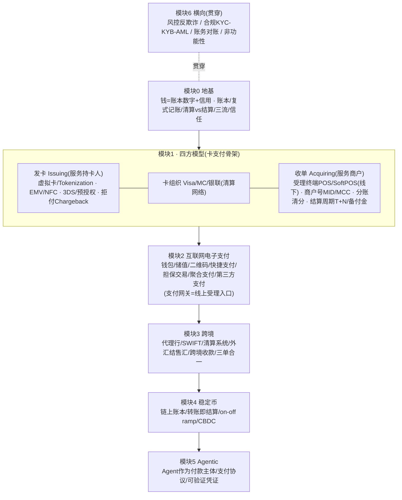

# 🗺️ 支付概念全景地图（速查手册）

> **用途**：支付领域全部核心术语的速查表。每个概念标注「所属学习模块 + 一句话第一性定义（解决什么问题）」。
> **读法**：先扫一遍建立全景，学到对应模块时再回来精读。与支付公司交流时当"术语词典"用。
> **配套**：详细讲解见各模块文件；学习顺序见 `学习路径总纲.md`。
> 最后更新：2026-06-04

---

## 📐 一张图看懂概念如何归位

---

## 模块 0 · 地基概念

| 术语 | 一句话第一性定义 |
|---|---|
| 钱(货币) | 解决以物易物三难题（双重巧合/度量/储藏）的工具；本质是账本数字+信用 |
| 账本 Ledger | 记录"谁拥有多少价值"的数据结构；支付=安全地改账本 |
| 复式记账 | 每笔交易借贷两条且相等，钱有来源有去向，自带纠错与审计 |
| 货币层级 | 央行货币>商业银行货币>私人货币，等级决定违约风险 |
| 清算 Clearing | 交换信息+算净额（说好谁该给谁多少），钱还没动 |
| 结算 Settlement | 真正划转资金且不可撤销（finality） |
| 结算最终性 Finality | 结算一旦完成不可逆，金融信任的命根子 |
| 三流 | 商流(订单)/信息流(指令报文)/资金流(真实划转)，三者不同步不同路径 |
| RTGS vs 净额 | 逐笔全额实时(安全耗流动性) vs 批量轧差(省流动性有敞口) |

---

## 模块 1 · 银行卡与四方模型概念

### 参与方与模型
| 术语 | 一句话第一性定义 |
|---|---|
| 四方模型 | 持卡人-发卡行-卡组织-收单行-商户，解决商户与发卡行 N×N 直连难题 |
| 三方模型 | 发卡=收单=卡组织同一家（Amex/Discover），费率高但可控 |
| 发卡 Issuing | 服务持卡人一侧：发卡、授信、承担风险 |
| 收单 Acquiring | 服务商户一侧：让商户有资格受理卡、把钱收进来 |
| 卡组织 Card Scheme | Visa/MC/银联，连接全球发卡收单的清算网络，不碰钱只做网络 |

### 受理终端
| 术语 | 一句话第一性定义 |
|---|---|
| POS | 线下商户受理刷卡的物理终端（收单入口） |
| SoftPOS | 把普通 NFC 手机变成 POS，去专用硬件、降商户门槛 |
| ATM | 自助存取款终端 |
| (支付网关) | 线上受理入口，"互联网时代的 POS"，详见模块2 |

### 卡与安全技术
| 术语 | 一句话第一性定义 |
|---|---|
| 虚拟卡 Virtual Card | 发卡的数字形态：无实体、即时生成、单次/限额，用于线上付款/供应商代付/费控 |
| EMV / 芯片卡 | 用芯片替代磁条，解决磁条易被复制盗刷 |
| NFC / 闪付 | 近场感应非接支付，提速线下受理 |
| Tokenization 令牌化 | 用 token 替代真实卡号，盗了也没用；Apple Pay/虚拟卡的根技术 |
| 3-D Secure (3DS) | 线上交易的持卡人身份二次验证（短信/生物），降线上欺诈与拒付责任 |
| 卡 BIN | 卡号前6-8位，标识发卡行/卡组织/卡种，用于路由 |

### 交易动作与费用
| 术语 | 一句话第一性定义 |
|---|---|
| 授权 Authorization | 刷卡瞬间验真伪+额度+冻结，钱未动 |
| 预授权 / 请款 Capture | 先冻结一笔(预授权)，后实际扣款(请款)；酒店/加油常用 |
| 撤销 Void/Reversal | 结算前取消授权（钱本就没动，最干净） |
| 退款 Refund | 结算后商户主动退钱给持卡人（友好、商户可控） |
| 拒付 / 退单 Chargeback | 结算后持卡人通过发卡行强制要回（商户被动、有罚金） |
| 增量授权 Incremental | 追加冻结（酒店续住/加油加钱） |
| 部分捕获 Partial Capture | 实际消费<预授权时只捕获部分 |
| 争议 Dispute | 拒付的完整处理流程 |
| Representment 再表述/抗辩 | 商户对拒付的反向举证（授权记录/3DS/物流凭证），拒付的"下半场" |
| 理由码 Reason Code | 拒付的分类（欺诈/未收到货/重复扣款/不符），决定举证要求与时效 |
| 仲裁 Arbitration | 拒付双方僵持时卡组织最终裁决 |
| VROL / Mastercom | Visa/MC 的在线争议解决平台 |
| 拒付胜率 Win Rate | 商户抗辩成功比例（跨境常仅30-40%） |
| 卡测试 Card Testing | 盗刷者批量小额试卡号验证有效性（速率异常特征） |
| 卡生命周期 | 申请→制卡→激活→用卡→挂失补卡→注销 |
| 账单 Billing | 账单周期/还款日/最小还款/循环利息/分期/积分（发卡行核心收入） |
| 交换费 Interchange | 收单侧付给发卡侧，激励发卡行发卡（积分返现的来源） |
| MDR 商户扣率 | 商户付的总手续费=交换费+卡组织费+收单加价 |
| MCC 商户类别码 | 标识商户行业，决定费率/风控/积分规则 |
| 商户号 MID | 商户在收单系统的唯一标识 |

---

## 模块 2 · 互联网电子支付概念

| 术语 | 一句话第一性定义 |
|---|---|
| 支付网关 Gateway | 线上受理入口（=互联网时代的 POS），连接商户与后端支付 |
| 支付处理器 Processor | 处理交易路由/授权/清算的后端引擎 |
| 第三方支付 | 支付宝/微信/PayPal/Stripe，平台型支付中介 |
| 担保交易 | 平台暂扣资金，确认收货才放款，解决买卖双方不信任 |
| 聚合支付 / 聚合收单 | 一个接口聚合多种支付方式/多家通道 |
| 收款 Collection | 帮商户把分散渠道的钱汇集回来（境内；跨境见模块3） |
| 电子钱包 / 储值账户 | 预存价值的账户（支付宝余额、八达通） |
| 充值 / 提现 / 储值 | 资金进出钱包的动作 |
| 绑卡 / 快捷支付 | 钱包与银行卡打通，免每次输卡信息；中国移动支付起飞关键 |
| 代扣协议 / 免密支付 | 用户授权后自动扣款（订阅、自动续费） |
| 二维码支付(主扫/被扫) | 用户扫商户码(主扫) / 商户扫用户码(被扫)，绕开 POS 硬件 |
| 备付金 / 资金存管 | 客户的钱必须隔离保管（合规红线），浮存收益来源 |
| 浮存 Float | 沉淀在账户里的客户资金产生的利息收益 |
| 网联 | 中国境内清算机构，"断直连"后第三方支付必须经它清算 |
| 银联(清算角色) | 中国银行卡清算机构 |
| ACH / 直接借记 | 银行账户间的批量清算网络（非卡） |
| 实时支付 RTP/FedNow/UPI | 7×24 即时到账的账户间支付系统 |

### 资金处理动作（横跨模块1-3）
| 术语 | 一句话第一性定义 |
|---|---|
| 代收 | 批量主动从用户账户收款（还房贷、扣水电费） |
| 代付 / 批量付款 | 批量主动付款给多方（发工资、供应商打款、佣金） |
| 代扣 | 协议扣款（订阅、自动续费） |
| 分账 / 清分 Split | 一笔钱按规则拆给多个收款方（平台/商户/服务商），电商平台核心 |
| 结算周期 T+0/T+1/D+1 | 钱多久到商户账户，现金流与风险的权衡 |
| 挂账 / 差错 / 红冲 | 对账差异的处理：暂挂、修正、反向冲销 |
| 备付 / 预付 | 预先存入的资金 |

---

## 模块 3 · 跨境支付概念

| 术语 | 一句话第一性定义 |
|---|---|
| 代理行 Correspondent | 在对方银行开户(nostro/vostro)，靠互相记账实现跨境接力 |
| Nostro/Vostro | 同一账户的两个视角："我们存你那的钱"/"你们存我这的钱" |
| SWIFT | 银行间报文网络，只传信息流不搬钱 |
| Fedwire/CHIPS/CHAPS/T2/CIPS | 各币种的清算结算系统（美元/英镑/欧元/人民币） |
| 外汇 / 汇率 / 汇差 | 货币兑换；汇差=给客户汇率与中间价的差，隐性利润 |
| 结售汇 | 把外汇换成本币(结汇)/本币换外汇(售汇)，中国受外汇管制 |
| 外汇管制 / 经常项目vs资本项目 | 国家对跨境资金流动的管理；贸易类(经常)宽松，投资类(资本)严 |
| 跨境收款 | 帮跨境卖家把境外货款收回国内（连连/PingPong/Airwallex/Payoneer） |
| 两段式模式 | 境外收+境内付，把跨境拆成两段境内，规避慢而贵的电汇 |
| 三单合一 | 跨境电商的订单/支付单/物流单向海关申报，验证交易真实性 |
| 跨境退税 | 出口退税 |
| ISO 20022 / pacs.008 | 新一代结构化金融报文标准，替代旧 SWIFT MT |
| G20 路线图 | 跨境支付提速降本的全球目标框架 |

---

## 模块 4 · 稳定币支付概念

| 术语 | 一句话第一性定义 |
|---|---|
| 稳定币 | 链上账本(全球/即时)+法币1:1锚定，解决加密货币价格波动 |
| USDC/USDT/PYUSD/RLUSD | 主流法币储备型稳定币 |
| 转账即结算 | 链上确认即达成最终性，无清算结算时间差 |
| on-ramp / off-ramp | 法币↔稳定币的入金/出金口，合规与外汇瓶颈在这 |
| 储备 Reserve | 稳定币背后的法币/国债兜底资产 |
| CBDC | 央行亲自发行的数字法定货币(最硬的钱) |
| mBridge | 多边央行数字货币桥，绕开代理行直接结算 |
| 智能合约 / 钱包 / 私钥 | 链上的可编程逻辑/资产容器/控制权凭证 |
| Travel Rule | 链上转账也要传递收付款人信息的反洗钱要求 |

---

## 模块 5 · Agentic Payment 概念

| 术语 | 一句话第一性定义 |
|---|---|
| Agentic Payment | AI Agent 作为新的"付款主体"代人付款 |
| 支付授权/意图 | 如何把人的支付授权安全传递给 Agent（核心新问题） |
| 可验证凭证 VC | 可加密验证的授权/身份凭证 |
| Google AP2/UCP | Google 的 Agent 支付/商务协议 |
| OpenAI×Stripe ACP | Agentic Commerce Protocol |
| Visa TAP / Mastercard Agent Pay | 卡组织的 Agent 支付方案 |
| Coinbase x402 | 用 HTTP 402 状态码做链上即时支付 |
| MCP | Agent 与外部工具/支付能力的连接协议 |

---

## 模块 6 · 横向专题概念（贯穿所有时代）

### 风控与反欺诈
| 术语 | 一句话第一性定义 |
|---|---|
| 风控引擎 | 规则+模型实时判断交易风险 |
| 反欺诈类型 | 盗刷/套现/洗钱/拒付欺诈/账户盗用 |
| 规则引擎→ML→Agent原生 | 风控技术的三代演进 |
| 设备指纹/行为分析 | 识别异常的技术手段 |

### 合规
| 术语 | 一句话第一性定义 |
|---|---|
| KYC 客户实名 | 核实个人客户身份 |
| KYB 企业实名 | 核实企业客户身份，商户准入核心 |
| AML 反洗钱 | 监测可疑交易并上报 |
| 制裁筛查 | 比对 OFAC/UN/EU 制裁名单 |
| PCI-DSS | 卡数据安全标准 |
| 牌照 | 支付/清算/跨境业务的监管准入 |
| 数据驻留 | 数据/资金不得违规出境 |

### 账务与系统
| 术语 | 一句话第一性定义 |
|---|---|
| 对账 Reconciliation | 自己账本与外部账单逐笔核对，账本的免疫系统 |
| 幂等 Idempotency | 同操作执行N次结果相同，支付第一信条 |
| 备付金/资金池 | 隔离保管的客户资金 |
| 高可用/强一致/资金安全 | 支付系统的金融级非功能性需求 |

---

## 边界概念（按需了解）

| 术语 | 一句话定义 | 相关模块 |
|---|---|---|
| BNPL 先买后付 | 分期/延后付款（Klarna/Affirm） | 模块2 |
| 信用支付(花呗/白条) | 平台授信的赊购 | 模块2 |
| 直连 vs 间连 | 商户直接连银行 vs 经第三方 | 模块2 |
| 发卡核心/收单核心/Switch | 支付系统的后端核心引擎 | 各技术篇 |
| 跨境B2B/B2C/海外仓 | 跨境贸易形态 | 模块3 |
