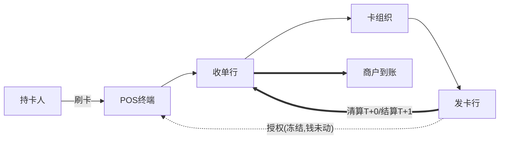
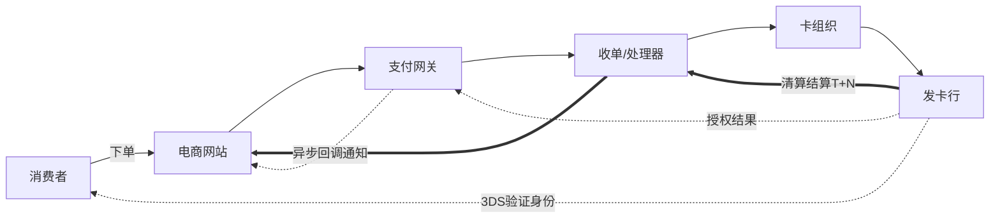
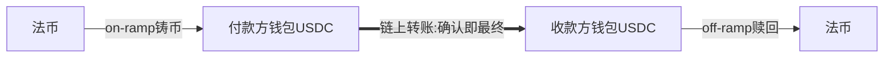
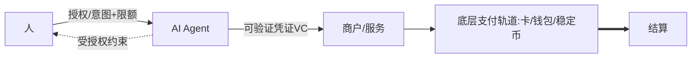

# 🔀 支付范式资金流对比（贯穿全程）

> **用途**：把不同支付范式的"参与方 / 三流路径 / 清结算方式 / 信任机制"**并排对比**。`支付概念全景地图.md` 对比的是**概念**，本文件对比的是**资金流程**。
> **读法**：学完每个模块后回来看对应范式，逐步看清全貌。这是和支付公司交流时最有价值的"全局对照表"。
> **状态说明**：✅=已在对应模块讲透 / ◐=框架已列待模块展开。随学习进度填充。
> 最后更新：2026-06-04

---

## 一、为什么需要这份对比

模块0 的便利店案例只是"POS 卡支付"一种范式。**支付的范式不是一个，而是一族**，它们的差异恰恰是理解支付演进的钥匙。每一种范式都是为解决上一种的某个痛点而出现：

---

## 二、六范式总览对比表（核心）

| 维度 | ①POS卡支付 | ②SoftPOS | ③电商网关 | ④钱包余额 | ⑤稳定币 | ⑥Agentic |
|---|---|---|---|---|---|---|
| **所属模块** | 1 ✅ | 1 ◐ | 2 ◐ | 2 ◐ | 4 ◐ | 5 ◐ |
| **受理入口** | POS硬件 | 手机(NFC) | 支付网关 | App/扫码 | 钱包/链 | Agent |
| **核心参与方** | 四方模型 | 四方模型 | 四方+网关 | 钱包运营方 | 链+发行方 | +AI Agent |
| **是否走卡组织** | 是 | 是 | 通常是 | **可不走** | 否 | 视底层 |
| **清算vs结算** | 分离T+N | 分离T+N | 分离T+N | 内部记账即时 | **合一(转账即结算)** | 取决底层轨道 |
| **身份/授权** | 卡+密码 | 卡+密码 | 卡+**3DS** | 登录+免密 | 私钥签名 | **授权传递给Agent** |
| **信任机制** | 信银行卡体系 | 信银行卡体系 | +平台担保 | 信钱包运营方 | 信代码/数学 | 信授权链 |
| **典型场景** | 便利店刷卡 | 小商户手机收款 | 网购 | 扫码付/订阅 | 跨境转账 | AI自动下单付款 |

> 🎯 **交流要点**：能指出"②SoftPOS 只是把受理终端从硬件换成手机，背后四方模型和资金流完全不变"——说明你抓住了"变的是入口，不变的是清结算骨架"。而"⑤稳定币把清算结算合一"才是真正的范式革命。

---

## 三、逐范式资金流图

### ① POS 线下卡支付（模块1 ✅ 已讲）
> 范式基准。四方模型，授权-清算-结算分离。

- 信息流：POS→收单→卡组织→发卡（授权）
- 资金流：清算算净额 → 次日结算划钱（finality）

### ② SoftPOS（模块1 ◐ 待展开）
> **关键认知：和①唯一的差别是受理终端从专用 POS 硬件变成普通 NFC 手机。** 四方模型、授权、清结算、资金流**完全相同**。解决的是"小微商户买不起/不便携 POS 机"的门槛问题。

- 变的：受理入口（手机 App + NFC，去专用硬件）
- 不变的：四方模型、清结算骨架

### ③ 电商网关支付（模块2 ◐ 待展开）
> 解决"线上没有 POS 机"。网关 = 互联网时代的 POS。新增 3DS 验证 + 异步回调。

- 新增：支付网关（线上受理）、3DS（线上身份验证）、异步回调（网络不可靠下的结果通知）
- 待模块2讲：网关vs处理器分工、担保交易、聚合支付

### ④ 钱包余额支付（模块2 ◐ 待展开）
> 解决"每次刷卡麻烦 + 需要小额即时"。**关键差异：余额支付可能完全不经过卡组织，在钱包内部记账即时完成。**

- 关键：若用余额支付，资金在钱包**内部账本**划转，即时、不走卡组织
- 若绑卡快捷支付，则退化为走卡组织（类似③）
- 待模块2讲：钱包/储值、绑卡快捷支付、备付金、二维码主扫被扫、网联清算

### ⑤ 稳定币支付（模块4 ◐ 待展开，stable-coin/ 已有研究）
> **真正的范式革命：链上同一账本，转账即结算，无清算结算分离，无代理行/卡组织。**

- 革命点：清算=结算（合一），全球同一账本，7×24
- 瓶颈：on/off-ramp 两端的合规与外汇（详见 stable-coin/ 与模块4）

### ⑥ Agentic 支付（模块5 ◐ 待展开，agentic-payment/ 已有研究）
> 新主体：AI Agent 代人付款。底层仍走①-⑤某种轨道，**新增的核心问题是"人如何把支付授权安全地传递给 Agent，出事谁担责"。**

- 新增：授权传递、可验证凭证、Agent 身份、争议归责
- 底层复用①-⑤，上层是"授权与信任"的新协议（详见 agentic-payment/ 与模块5）

---

## 四、演进逻辑：每个范式解决了什么

| 从→到 | 解决的痛点 |
|---|---|
| POS → SoftPOS | 专用硬件成本高、不便携 → 普通手机即可收款 |
| 线下 → 电商网关 | 线上没有物理 POS → 网关做线上受理 |
| 卡 → 钱包余额 | 每次刷卡麻烦、小额慢 → 预存价值+免密即时 |
| 中心化 → 稳定币 | 中介多、慢、贵、清结算时滞 → 去中介、转账即结算 |
| 人付 → Agent付 | 人工逐笔操作 → AI 自动代付（但带来授权新问题） |

> **最高层洞察**：受理入口在变（POS→手机→网关→App→链→Agent），但**底层始终是"改账本"**。范式越往后，越想缩短"从付款意图到账本最终改定"的链条——稳定币把它压到一次链上确认，Agentic 把发起动作交给了 AI。

---

## 五、待填充清单（随模块推进补全）

- [ ] ② SoftPOS：技术实现（手机 NFC/认证、与传统 POS 安全等级差异）— 模块1
- [ ] ③ 电商网关：网关架构、3DS 流程、异步回调与对账 — 模块2
- [ ] ④ 钱包：内部记账模型、绑卡快捷支付、二维码、备付金、网联 — 模块2
- [ ] ⑤ 稳定币：链上转账机制细节、on/off-ramp 合规 — 模块4
- [ ] ⑥ Agentic：各协议授权机制对比 — 模块5
- [ ] 跨境范式：代理行接力资金流（已在 traditional-payment/ 报告，可链接过来）— 模块3
